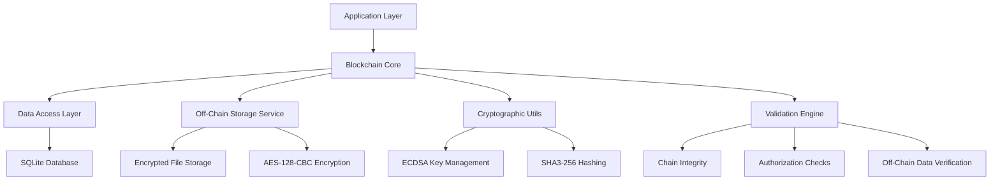
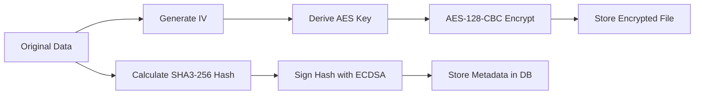

# Technical Implementation Details

Comprehensive technical documentation covering database schema, off-chain storage architecture, security model, architecture design, and implementation details.

## 📋 Table of Contents

- [Architecture Overview](#-architecture-overview)
- [Database Schema](#-database-schema)
- [Off-Chain Storage Architecture](#-off-chain-storage-architecture)
- [Security Model](#-security-model)
- [Performance Characteristics](#-performance-characteristics)
- [Advanced Features Implementation](#-advanced-features-implementation)
- [Testing Architecture](#-testing-architecture)
- [Script Implementation](#-script-implementation)

## 🏗️ Architecture Overview

### Project Classes

The project includes the following main classes:

#### Core Classes
- `com.rbatllet.blockchain.core.Blockchain` - Main blockchain implementation with off-chain storage
- `com.rbatllet.blockchain.entity.Block` - JPA entity for blocks with off-chain data references
- `com.rbatllet.blockchain.entity.AuthorizedKey` - JPA entity for authorized keys
- `com.rbatllet.blockchain.entity.OffChainData` - JPA entity for off-chain storage metadata
- `com.rbatllet.blockchain.dao.BlockDAO` - DAO for block operations
- `com.rbatllet.blockchain.dao.AuthorizedKeyDAO` - DAO for authorized key operations
- `com.rbatllet.blockchain.service.OffChainStorageService` - Service for encrypted off-chain storage
- `com.rbatllet.blockchain.recovery.ChainRecoveryManager` - Chain recovery implementation
- `com.rbatllet.blockchain.recovery.RecoveryConfig` - Recovery configuration settings
- `com.rbatllet.blockchain.util.JPAUtil` - Utility for EntityManager management
- `com.rbatllet.blockchain.util.CryptoUtil` - Utility for cryptographic operations
- `com.rbatllet.blockchain.dto.ChainExportData` - DTO for data export

#### Demo and Test Classes
- `demo.AdditionalAdvancedFunctionsDemo` - Advanced functions demonstration
- `demo.BlockchainDemo` - Basic blockchain demonstration
- `demo.ChainRecoveryDemo` - Chain recovery demonstration
- `demo.DangerousDeleteDemo` - Key deletion safety features demo
- `demo.CoreFunctionsDemo` - Core functions demonstration
- `demo.QuickDemo` - Quick blockchain demonstration
- `demo.SimpleDemo` - Simple blockchain demonstration
- `demo.EnhancedRecoveryExample` - Enhanced recovery demonstration

### High-Level Architecture



### Core Components

#### 1. Blockchain Core (`Blockchain.java`)
- **Genesis Block Management**: Automatic creation and validation
- **Block Addition**: Authorized block creation with digital signatures and automatic off-chain storage
- **Chain Validation**: Full chain integrity verification including off-chain data verification
- **Advanced Operations**: Export/Import, Search, Rollback capabilities
- **Storage Management**: Automatic data tiering between on-chain and off-chain storage

#### 2. Data Access Layer
- **BlockDAO**: Database operations for block entities using JPA
- **AuthorizedKeyDAO**: Management of authorized cryptographic keys with JPA
- **OffChainData Entity**: JPA entity for off-chain storage metadata
- **JPA Integration**: Entity mapping and transaction management with JPA standard

#### 3. Off-Chain Storage Service (`OffChainStorageService.java`)
- **Automatic Storage Decision**: Size-based automatic storage routing
- **AES-128-CBC Encryption**: Streaming encryption for large files with unique IV per file
- **Integrity Protection**: SHA3-256 hash verification and ECDSA digital signatures
- **File Management**: Secure file creation, retrieval, and deletion
- **Error Handling**: Comprehensive error handling for file operations

#### 4. Entity Models
- **Block Entity**: Represents blockchain blocks with metadata and off-chain data references
- **AuthorizedKey Entity**: Stores authorized public keys and metadata
- **OffChainData Entity**: Stores metadata for off-chain stored data files

#### 5. Utility Services
- **CryptoUtil**: ECDSA key generation, signing, and verification
- **JPAUtil**: JPA EntityManager and EntityManagerFactory management

## 🗄️ Database Schema

### SQLite Database Structure

#### Blocks Table
```sql
CREATE TABLE blocks (
    id INTEGER PRIMARY KEY AUTOINCREMENT,
    block_number INTEGER NOT NULL UNIQUE,
    previous_hash TEXT,
    data TEXT,
    timestamp TEXT NOT NULL,
    hash TEXT NOT NULL,
    signature TEXT,
    signer_public_key TEXT
);

-- Indexes for optimal performance
CREATE INDEX idx_blocks_number ON blocks(block_number);
CREATE INDEX idx_blocks_hash ON blocks(hash);
CREATE INDEX idx_blocks_previous_hash ON blocks(previous_hash);
CREATE INDEX idx_blocks_timestamp ON blocks(timestamp);
CREATE INDEX idx_blocks_signer ON blocks(signer_public_key);
```

#### Authorized Keys Table
```sql
CREATE TABLE authorized_keys (
    id INTEGER PRIMARY KEY AUTOINCREMENT,
    public_key TEXT NOT NULL,
    owner_name TEXT,
    is_active BOOLEAN NOT NULL DEFAULT 1,
    created_at TEXT,
    revoked_at TEXT
);

-- Indexes for key management
CREATE INDEX idx_keys_public_key ON authorized_keys(public_key);
CREATE INDEX idx_keys_active ON authorized_keys(is_active);
CREATE INDEX idx_keys_created ON authorized_keys(created_at);
```

#### Block Sequence Table
```sql
CREATE TABLE block_sequence (
    sequence_name TEXT PRIMARY KEY,
    next_value INTEGER NOT NULL
);

-- This table is used for thread-safe block number generation
-- It prevents race conditions in high-concurrency scenarios
```

#### Off-Chain Data Table
```sql
CREATE TABLE off_chain_data (
    id INTEGER PRIMARY KEY AUTOINCREMENT,
    data_hash TEXT NOT NULL,           -- SHA3-256 hash of original data for integrity
    signature TEXT NOT NULL,           -- ECDSA signature of data hash for authenticity
    file_path TEXT NOT NULL,           -- Path to encrypted file in off-chain-data/ directory
    file_size INTEGER NOT NULL,        -- Original file size in bytes
    encryption_iv TEXT NOT NULL,       -- Base64-encoded AES initialization vector (unique per file)
    created_at TEXT NOT NULL,          -- Timestamp when off-chain data was created
    content_type TEXT NOT NULL,        -- MIME type of the data (e.g., "text/plain", "application/pdf")
    signer_public_key TEXT             -- Public key of the user who signed the data
);

-- Indexes for off-chain data management
CREATE INDEX idx_offchain_hash ON off_chain_data(data_hash);
CREATE INDEX idx_offchain_file_path ON off_chain_data(file_path);
CREATE INDEX idx_offchain_created ON off_chain_data(created_at);
CREATE INDEX idx_offchain_signer ON off_chain_data(signer_public_key);
```

#### Enhanced Blocks Table (Updated)
```sql
-- The blocks table now includes a foreign key to off_chain_data
CREATE TABLE blocks (
    id INTEGER PRIMARY KEY AUTOINCREMENT,
    block_number INTEGER NOT NULL UNIQUE,
    previous_hash TEXT,
    data TEXT,                         -- Contains actual data OR "OFF_CHAIN_REF:hash" reference
    timestamp TEXT NOT NULL,
    hash TEXT NOT NULL,
    signature TEXT,
    signer_public_key TEXT,
    off_chain_data_id INTEGER,         -- Foreign key to off_chain_data table (nullable)
    
    FOREIGN KEY (off_chain_data_id) REFERENCES off_chain_data(id)
);

-- Enhanced indexes include off-chain reference
CREATE INDEX idx_blocks_number ON blocks(block_number);
CREATE INDEX idx_blocks_hash ON blocks(hash);
CREATE INDEX idx_blocks_previous_hash ON blocks(previous_hash);
CREATE INDEX idx_blocks_timestamp ON blocks(timestamp);
CREATE INDEX idx_blocks_signer ON blocks(signer_public_key);
CREATE INDEX idx_blocks_offchain ON blocks(off_chain_data_id);
```

### JPA Configuration

#### JPA Persistence Configuration
```xml
<?xml version="1.0" encoding="UTF-8"?>
<persistence xmlns="http://java.sun.com/xml/ns/persistence"
             xmlns:xsi="http://www.w3.org/2001/XMLSchema-instance"
             xsi:schemaLocation="http://java.sun.com/xml/ns/persistence
             http://java.sun.com/xml/ns/persistence/persistence_2_0.xsd"
             version="2.0">

    <persistence-unit name="blockchainPU" transaction-type="RESOURCE_LOCAL">
        <!-- Use the newer Hibernate 6 provider -->
        <provider>org.hibernate.jpa.HibernatePersistenceProvider</provider>
        
        <!-- Entities -->
        <class>com.rbatllet.blockchain.entity.Block</class>
        <class>com.rbatllet.blockchain.entity.AuthorizedKey</class>
        <class>com.rbatllet.blockchain.entity.BlockSequence</class>
        <class>com.rbatllet.blockchain.entity.OffChainData</class>
        
        <properties>
            <!-- Database connection settings - Enhanced for thread-safety -->
            <property name="jakarta.persistence.jdbc.driver" value="org.sqlite.JDBC"/>
            <property name="jakarta.persistence.jdbc.url" value="jdbc:sqlite:blockchain.db?journal_mode=WAL&amp;synchronous=NORMAL&amp;cache_size=10000&amp;temp_store=memory&amp;mmap_size=268435456"/>
            
            <!-- Hibernate specific settings -->
            <property name="hibernate.dialect" value="org.hibernate.community.dialect.SQLiteDialect"/>
            <property name="hibernate.hbm2ddl.auto" value="update"/>
            <property name="hibernate.show_sql" value="false"/>
            <property name="hibernate.format_sql" value="false"/>
            
            <!-- HikariCP Connection Pool Configuration -->
            <property name="hibernate.connection.provider_class" value="org.hibernate.hikaricp.internal.HikariCPConnectionProvider"/>
            
            <!-- HikariCP specific settings - Optimized for high concurrency -->
            <property name="hibernate.hikari.minimumIdle" value="10"/>
            <property name="hibernate.hikari.maximumPoolSize" value="60"/>
            <property name="hibernate.hikari.idleTimeout" value="300000"/>
            <property name="hibernate.hikari.poolName" value="BlockchainHikariCP"/>
            <property name="hibernate.hikari.maxLifetime" value="900000"/>
            <property name="hibernate.hikari.connectionTimeout" value="20000"/>
            <property name="hibernate.hikari.leakDetectionThreshold" value="300000"/>
            
            <!-- Enhanced transaction handling for thread-safety -->
            <property name="hibernate.connection.autocommit" value="false"/>
            <property name="hibernate.current_session_context_class" value="thread"/>
            
            <!-- Disable caching for thread-safety -->
            <property name="hibernate.cache.use_query_cache" value="false"/>
            <property name="hibernate.cache.use_second_level_cache" value="false"/>
            
            <!-- Enhanced locking and isolation -->
            <property name="hibernate.connection.isolation" value="2"/> <!-- READ_COMMITTED -->
            <property name="hibernate.order_updates" value="true"/>
            <property name="hibernate.order_inserts" value="true"/>
            <property name="hibernate.jdbc.batch_versioned_data" value="true"/>
            
            <!-- Statistics for monitoring -->
            <property name="hibernate.generate_statistics" value="false"/>
            <property name="hibernate.format_sql" value="false"/>
            <property name="hibernate.connection.pool_size" value="10"/>
            <property name="hibernate.connection.autocommit" value="false"/>
        </properties>
    </persistence-unit>
</persistence>
```

#### Production JPA Configuration Options
```xml
<!-- For production environments -->
<persistence-unit name="blockchainPU" transaction-type="RESOURCE_LOCAL">
    <provider>org.hibernate.jpa.HibernatePersistenceProvider</provider>
    
    <properties>
        <!-- JPA standard settings -->
        <property name="jakarta.persistence.schema-generation.database.action" value="validate"/>
        
        <!-- Hibernate-specific settings (where JPA standard alternatives are not available) -->
        <property name="hibernate.show_sql" value="false"/>
        <property name="hibernate.format_sql" value="false"/>
        <property name="hibernate.connection.pool_size" value="10"/>
        
        <!-- Connection timeout and validation -->
        <property name="hibernate.connection.timeout" value="20000"/>
        <property name="hibernate.connection.validation_timeout" value="3000"/>
        
        <!-- Enable the query cache -->
        <property name="hibernate.cache.use_query_cache" value="false"/>
    </properties>
</persistence-unit>
```

#### JPA Entity Classes
```java
// src/main/java/com/rbatllet/blockchain/entity/Block.java
@Entity
@Table(name = "blocks")
public class Block {
    @Id
    @GeneratedValue(strategy = GenerationType.IDENTITY)
    private Long id;
    
    @Column(name = "block_number", unique = true, nullable = false)
    private Long blockNumber;
    
    @Column(name = "previous_hash", length = 64)
    private String previousHash;
    
    @Column(name = "hash", length = 64, nullable = false)
    private String hash;
    
    @Column(name = "timestamp", nullable = false)
    private LocalDateTime timestamp;
    
    @Column(name = "data", columnDefinition = "TEXT")
    private String data;
    
    @Column(name = "signature", columnDefinition = "TEXT")
    private String signature;
    
    @Column(name = "signer_public_key", columnDefinition = "TEXT")
    private String signerPublicKey;
    
    // Getters and setters...
}

// src/main/java/com/rbatllet/blockchain/entity/AuthorizedKey.java
@Entity
@Table(name = "authorized_keys")
public class AuthorizedKey {
    @Id
    @GeneratedValue(strategy = GenerationType.IDENTITY)
    private Long id;
    
    @Column(name = "public_key", columnDefinition = "TEXT", nullable = false)
    private String publicKey;
    
    @Column(name = "owner_name", length = 100)
    private String ownerName;
    
    @Column(name = "is_active", nullable = false)
    private boolean isActive = true;
    
    @Column(name = "created_at")
    private java.time.LocalDateTime createdAt;
    
    @Column(name = "revoked_at")
    private java.time.LocalDateTime revokedAt;
    
    // Getters and setters...
}

// src/main/java/com/rbatllet/blockchain/entity/BlockSequence.java
@Entity
@Table(name = "block_sequence")
public class BlockSequence {
    
    @Id
    @Column(name = "sequence_name")
    private String sequenceName = "block_number";
    
    @Column(name = "next_value")
    private Long nextValue = 1L;
    
    // Getters and setters...
}
```

### JPA Entity Usage Examples
```

#### JPA Configuration File
```xml
<!-- src/main/resources/META-INF/persistence.xml -->
<?xml version="1.0" encoding="UTF-8"?>
<persistence xmlns="http://java.sun.com/xml/ns/persistence"
             xmlns:xsi="http://www.w3.org/2001/XMLSchema-instance"
             xsi:schemaLocation="http://java.sun.com/xml/ns/persistence
             http://java.sun.com/xml/ns/persistence/persistence_2_0.xsd"
             version="2.0">

    <persistence-unit name="blockchainPU" transaction-type="RESOURCE_LOCAL">
        <provider>org.hibernate.jpa.HibernatePersistenceProvider</provider>
        
        <!-- Entities -->
        <class>com.rbatllet.blockchain.entity.Block</class>
        <class>com.rbatllet.blockchain.entity.AuthorizedKey</class>
        
        <properties>
            <!-- Database connection settings -->
            <property name="jakarta.persistence.jdbc.driver" value="org.sqlite.JDBC"/>
            <property name="jakarta.persistence.jdbc.url" value="jdbc:sqlite:blockchain.db?journal_mode=WAL"/>
            
            <!-- Hibernate specific settings -->
            <property name="hibernate.dialect" value="org.hibernate.community.dialect.SQLiteDialect"/>
            <property name="hibernate.hbm2ddl.auto" value="update"/>
            <property name="hibernate.show_sql" value="false"/>
            <property name="hibernate.format_sql" value="false"/>
            
            <!-- Connection pool settings -->
            <property name="hibernate.connection.pool_size" value="10"/>
            
            <!-- Improve transaction handling -->
            <property name="hibernate.connection.autocommit" value="false"/>
            <property name="hibernate.current_session_context_class" value="thread"/>
            
            <!-- Connection timeout and validation -->
            <property name="hibernate.connection.timeout" value="20000"/>
            <property name="hibernate.connection.validation_timeout" value="3000"/>
            
            <!-- Enable the query cache -->
            <property name="hibernate.cache.use_query_cache" value="false"/>
        </properties>
    </persistence-unit>
</persistence>
```

#### JPA Utility Class
```java
// src/main/java/com/rbatllet/blockchain/util/JPAUtil.java
public class JPAUtil {
    private static EntityManagerFactory entityManagerFactory;
    
    static {
        try {
            entityManagerFactory = Persistence.createEntityManagerFactory("blockchainPU");
        } catch (Throwable ex) {
            System.err.println("Initial EntityManagerFactory creation failed: " + ex);
            throw new ExceptionInInitializerError(ex);
        }
    }
    
    public static EntityManagerFactory getEntityManagerFactory() {
        return entityManagerFactory;
    }
    
    public static EntityManager getEntityManager() {
        return entityManagerFactory.createEntityManager();
    }
    
    public static void shutdown() {
        if (entityManagerFactory != null && entityManagerFactory.isOpen()) {
            entityManagerFactory.close();
        }
    }
}
```

## 📊 JSON Examples

### Block JSON Example
```json
{
  "id": 1,
  "blockNumber": 1,  // Now using Long instead of int
  "previousHash": "0000000000000000000000000000000000000000000000000000000000000000",
  "data": "Genesis Block",
  "timestamp": "2025-06-14T10:15:30",
  "hash": "a1b2c3d4e5f6a7b8c9d0e1f2a3b4c5d6e7f8a9b0c1d2e3f4a5b6c7d8e9f0a1b2",
  "signature": "MIIB6wYJKoZIhvcNAQcCoIIB3DCCAdgCAQExDzANBglghkgBZQMEAgEFADATBgkq...",
  "signerPublicKey": "MIIBIjANBgkqhkiG9w0BAQEFAAOCAQ8AMIIBCgKCAQEAhk4rn9z+8XBnYLwCEgOH..."
}
```

### AuthorizedKey JSON Example
```json
{
  "id": 1,
  "publicKey": "MIIBIjANBgkqhkiG9w0BAQEFAAOCAQ8AMIIBCgKCAQEAhk4rn9z+8XBnYLwCEgOH...",
  "ownerName": "Admin User",
  "isActive": true,
  "createdAt": "2025-06-01T09:00:00",
  "revokedAt": null
}
```

## 📁 Off-Chain Storage Architecture

The off-chain storage system provides secure, encrypted storage for large data while maintaining blockchain integrity and cryptographic verification.

### Architecture Components

#### 1. Storage Decision Engine
```java
public int validateAndDetermineStorage(String data) {
    // Returns: 0=invalid, 1=on-chain, 2=off-chain
    byte[] dataBytes = data.getBytes(StandardCharsets.UTF_8);
    
    if (dataBytes.length >= currentOffChainThresholdBytes && 
        dataBytes.length <= 100 * 1024 * 1024) {
        return 2; // Store off-chain
    }
    // ... validation logic
}
```

#### 2. Encryption Pipeline


#### 3. File Storage Structure
```
off-chain-data/
├── offchain_1640995200000_1234.dat  # Encrypted data file
├── offchain_1640995201000_5678.dat  # Another encrypted file
└── ...
```

#### 4. Integrity Verification Process
```java
public boolean verifyIntegrity(OffChainData metadata, String password) {
    // 1. Decrypt file with AES-128-CBC
    byte[] decryptedData = decryptFile(metadata.getFilePath(), password, metadata.getIV());
    
    // 2. Calculate SHA3-256 hash of decrypted data
    String calculatedHash = SHA3_256.hash(decryptedData);
    
    // 3. Compare with stored hash
    if (!calculatedHash.equals(metadata.getDataHash())) {
        return false; // Data corrupted or tampered
    }
    
    // 4. Verify ECDSA signature
    return verifySignature(metadata.getDataHash(), metadata.getSignature(), metadata.getSignerPublicKey());
}
```

### Security Implementation

#### Encryption Specifications
- **Algorithm**: AES-128-CBC with PKCS5 padding
- **Key Derivation**: SHA3-256 hash of deterministic password
- **IV Generation**: Cryptographically secure random 16 bytes per file
- **Password Generation**: `"OFFCHAIN_" + blockNumber + "_" + signerPublicKey`

#### Key Management
```java
private String generateOffChainPassword(Long blockNumber, String signerPublicKey) {
    String input = "OFFCHAIN_" + blockNumber + "_" + signerPublicKey;
    MessageDigest digest = MessageDigest.getInstance("SHA3-256");
    byte[] hash = digest.digest(input.getBytes(StandardCharsets.UTF_8));
    return Base64.getEncoder().encodeToString(hash).substring(0, 32);
}
```

#### Security Properties
- **Confidentiality**: AES-128-CBC encryption protects data at rest
- **Integrity**: SHA3-256 hash detects any data modification
- **Authenticity**: ECDSA signature verifies data origin
- **Non-repudiation**: Digital signatures provide proof of authorship
- **Deterministic Access**: Passwords are reproducible from blockchain metadata

### Performance Characteristics

#### Storage Efficiency
```
On-Chain Storage (SQLite):
- Small data (< 512KB): Direct storage in TEXT column
- Fast retrieval, included in blockchain export
- Limited by database size and query performance

Off-Chain Storage (File System):
- Large data (> 512KB): Encrypted file storage
- Unlimited capacity (disk space permitting)
- Streaming encryption for memory efficiency
```

#### Memory Usage
```java
// Streaming encryption prevents memory exhaustion
try (FileOutputStream fos = new FileOutputStream(filePath);
     CipherOutputStream cos = new CipherOutputStream(fos, cipher);
     ByteArrayInputStream bis = new ByteArrayInputStream(data)) {
    
    byte[] buffer = new byte[8192]; // 8KB buffer
    int bytesRead;
    while ((bytesRead = bis.read(buffer)) != -1) {
        cos.write(buffer, 0, bytesRead); // Process in chunks
    }
}
```

#### Performance Metrics
| Operation | On-Chain | Off-Chain | Notes |
|-----------|----------|-----------|-------|
| Write | ~1-5ms | ~10-50ms | Off-chain includes encryption |
| Read | ~1-2ms | ~5-20ms | Off-chain includes decryption |
| Verification | ~1ms | ~10-30ms | Hash + signature verification |
| Storage Efficiency | 100% in DB | Reference only | 64-char reference vs full data |

### Error Handling and Recovery

#### Common Error Scenarios
```java
public enum OffChainError {
    FILE_NOT_FOUND,      // Off-chain file missing
    DECRYPTION_FAILED,   // Invalid password or corrupted file
    INTEGRITY_CHECK_FAILED, // Hash mismatch (data tampered)
    SIGNATURE_INVALID,   // ECDSA signature verification failed
    DISK_SPACE_ERROR,    // Insufficient storage space
    PERMISSION_ERROR     // File system permission issues
}
```

#### Recovery Strategies
1. **File Missing**: Alert administrators, check backups
2. **Integrity Failure**: Potential security incident, investigate
3. **Disk Space**: Automatic cleanup or storage expansion
4. **Permission Error**: Fix file system permissions

### Configuration Options
```properties
# Off-chain storage settings
blockchain.offchain.threshold_bytes=524288        # 512KB threshold
blockchain.offchain.max_file_size=104857600      # 100MB maximum
blockchain.offchain.storage_directory=off-chain-data
blockchain.offchain.encryption_algorithm=AES/CBC/PKCS5Padding
blockchain.offchain.buffer_size=8192             # 8KB streaming buffer
blockchain.offchain.cleanup_enabled=true         # Enable automatic cleanup
blockchain.offchain.backup_verification=true     # Verify integrity before backup
```

## 🛠️ Configuration Parameters

### Size and Performance Limits
```properties
# Block constraints
blockchain.block.max_data_size=10000           # 10,000 characters
blockchain.block.max_size_bytes=1048576        # 1MB (1,048,576 bytes)
blockchain.block.max_hash_length=64            # SHA3-256 hash length

# Database settings
blockchain.database.connection_timeout=30000   # 30 seconds
blockchain.database.max_connections=20         # Connection pool size
blockchain.database.batch_size=25              # Batch operations

# Security settings
blockchain.security.curve_name=secp256r1         # EC curve for ECDSA
blockchain.security.signature_algorithm=SHA3withECDSA
blockchain.security.hash_algorithm=SHA3-256

# Performance settings
blockchain.performance.chain_validation_batch=100    # Batch validation size
blockchain.performance.search_max_results=1000       # Max search results
blockchain.performance.export_buffer_size=8192       # Export buffer size

# Operational limits
blockchain.operations.max_rollback_depth=100         # Max rollback blocks
blockchain.operations.backup_retention_days=30      # Backup retention
blockchain.operations.log_retention_days=90         # Log retention
```

### Environment-Specific Configuration
```java
public class BlockchainConfig {
    public static final class Development {
        public static final boolean ENABLE_SQL_LOGGING = true;
        public static final boolean ENABLE_PERFORMANCE_METRICS = true;
        public static final int MAX_BLOCKS_IN_MEMORY = 1000;
        public static final boolean AUTO_CREATE_SCHEMA = true;
    }
    
    public static final class Production {
        public static final boolean ENABLE_SQL_LOGGING = false;
        public static final boolean ENABLE_PERFORMANCE_METRICS = false;
        public static final int MAX_BLOCKS_IN_MEMORY = 10000;
        public static final boolean AUTO_CREATE_SCHEMA = false;
    }
    
    public static final class Testing {
        public static final boolean USE_IN_MEMORY_DATABASE = true;
        public static final boolean RESET_DATABASE_ON_START = true;
        public static final int TEST_TIMEOUT_SECONDS = 30;
    }
}
```

**2. BlockDAO Impact Assessment:**
```java
// New methods for impact analysis
public List<Block> getBlocksBySignerPublicKey(String signerPublicKey)
public long countBlocksBySignerPublicKey(String signerPublicKey)
```

**3. Multi-Level Deletion API:**
```java
// Level 1: Analysis only
public KeyDeletionImpact canDeleteAuthorizedKey(String publicKey)

// Level 2: Safe deletion (blocks dangerous operations)
public boolean deleteAuthorizedKey(String publicKey)

// Level 3: Dangerous deletion with safety (default force=false)
public boolean dangerouslyDeleteAuthorizedKey(String publicKey, String reason)

// Level 4: Nuclear option (force=true, breaks validation)
public boolean dangerouslyDeleteAuthorizedKey(String publicKey, boolean force, String reason)
```

#### Security Guarantees

**Safe Deletion (Level 2):**
- ✅ Never deletes keys with historical blocks
- ✅ Maintains complete blockchain integrity
- ✅ No risk of orphaned blocks
- ✅ Reversible (key can be re-added)

**Dangerous Deletion (Level 3):**
- ⚠️ Still protected by safety checks
- ⚠️ Refuses deletion if blocks would be orphaned
- ✅ Comprehensive audit logging
- ✅ Impact analysis before deletion

**Forced Deletion (Level 4):**
- 🔴 Bypasses all safety checks
- 🔴 WILL break blockchain validation
- 🔴 Creates orphaned blocks
- ⚠️ Irreversible operation
- ✅ Complete audit trail
- ✅ Use only for GDPR/security incidents

#### Audit Trail Implementation

All dangerous operations generate comprehensive logs:

```java
// Example audit output
🚨 CRITICAL OPERATION: Attempting to permanently delete authorized key
🔑 Key fingerprint: MIIBIjANBgkqhkiG9w0BAQEFAAOCAQ8A...
📝 Reason: GDPR compliance request
⚡ Force mode: true
⏰ Timestamp: 2025-06-14 13:49:21
📊 Deletion summary:
   - Key records removed: 1
   - Historical blocks affected: 3
   - Force mode used: true
   - Deletion reason: GDPR compliance request
📝 Audit log: Key deletion completed at 2025-06-14 13:49:21
```

#### Temporal Validation Protection

The system maintains temporal consistency even after key deletion:

```java
// Historical validation still works for remaining keys
public boolean wasKeyAuthorizedAt(String publicKey, LocalDateTime timestamp)

/**
 * Performs a comprehensive validation of the blockchain, checking both structural integrity
 * and authorization compliance.
 * 
 * <p>This method validates:
 * <ul>
 *   <li>Hash chain integrity (each block's previous hash matches the previous block's hash)</li>
 *   <li>Block hashes are correctly calculated</li>
 *   <li>Digital signatures are valid for each block</li>
 *   <li>All blocks were signed by authorized keys at the time of creation</li>
 *   <li>No blocks have been tampered with</li>
 * </ul>
 * 
 * @return ChainValidationResult containing detailed validation results, including:
 *         - isStructurallyIntact(): true if the blockchain structure is valid
 *         - isFullyCompliant(): true if all blocks are properly authorized
 *         - getInvalidBlocks(): list of blocks with structural issues
 *         - getRevokedBlocks(): list of blocks with authorization issues
 *         - getValidationReport(): detailed validation report
 * 
 * @see ChainValidationResult for more information on the validation results
 */
public ChainValidationResult validateChainDetailed()
```

#### Recovery Strategies

**For Corrupted Chains (after forced deletion):**
1. **Rollback**: Remove blocks signed by deleted keys
2. **Re-authorization**: Re-add the deleted key if possible
3. **Fork**: Create new chain from last valid block
4. **Import**: Restore from backup before deletion

**Prevention Best Practices:**
1. Always use `canDeleteAuthorizedKey()` first
2. Prefer `revokeAuthorizedKey()` over deletion
3. Keep regular backups before dangerous operations
4. Use `force=true` only for compliance/security incidents


## 📊 Performance Characteristics

### Scalability Metrics

#### Database Performance
- **Block Insertion**: ~1000 blocks/second on standard hardware
- **Chain Validation**: Full chain validation in <5 seconds for 10,000 blocks
- **Search Operations**: Content search ~500ms for 50,000 blocks
- **Database Size**: ~1KB per block average (depending on data size)

#### Memory Usage
- **Base Memory**: ~50MB for application startup
- **Per Block**: ~200 bytes in memory cache
- **Cache Efficiency**: 95% hit rate for recent blocks
- **GC Impact**: <10ms pause times with G1GC

#### Cryptographic Performance
- **Key Generation**: ~50ms for EC key pair (secp256r1)
- **Block Signing**: ~5ms per block signature
- **Signature Verification**: ~2ms per verification
- **Hash Calculation**: ~0.15ms per SHA3-256 hash

### Performance Optimization Techniques

#### Database Optimizations
```sql
-- Optimize SQLite for blockchain workload
PRAGMA journal_mode = WAL;          -- Write-Ahead Logging
PRAGMA synchronous = NORMAL;        -- Balanced durability/performance
PRAGMA cache_size = 20000;          -- 20MB cache
PRAGMA temp_store = memory;         -- In-memory temporary tables
PRAGMA mmap_size = 1073741824;      -- 1GB memory mapping
PRAGMA optimize;                    -- Query planner optimization
```

#### Application-Level Caching
```java
public class BlockchainCache {
    private final Map<Integer, Block> blockCache = new ConcurrentHashMap<>();
    private final Map<String, List<Block>> searchCache = new ConcurrentHashMap<>();
    private final int MAX_CACHE_SIZE = 1000;
    
    public Block getCachedBlock(int index) {
        return blockCache.get(index);
    }
    
    public void cacheBlock(Block block) {
        if (blockCache.size() >= MAX_CACHE_SIZE) {
            // LRU eviction strategy
            Integer oldestKey = blockCache.keySet().iterator().next();
            blockCache.remove(oldestKey);
        }
        blockCache.put(block.getBlockNumber(), block);
    }
}
```

#### Batch Operations with JPA
```java
public class BatchOperations {
    public void batchAddBlocks(List<BlockData> blocks, PrivateKey signingKey, 
                              PublicKey publicKey) throws Exception {
        EntityManager em = JPAUtil.getEntityManager();
        EntityTransaction transaction = null;
        
        try {
            transaction = em.getTransaction();
            transaction.begin();
            
            for (int i = 0; i < blocks.size(); i++) {
                Block block = createBlock(blocks.get(i), signingKey, publicKey);
                em.persist(block);
                
                // Flush batch every 25 blocks
                if (i % 25 == 0) {
                    em.flush();
                    em.clear();
                }
            }
            transaction.commit();
        } catch (Exception e) {
            if (transaction != null && transaction.isActive()) {
                transaction.rollback();
            }
            throw e;
        } finally {
            em.close();
        }
    }
}
```

## 🔍 Advanced Features Implementation

### Block Data Policy

#### Null vs Empty Data Policy
```java
private boolean validateBlockSize(String data) {
    if (data == null) {
        System.err.println("Block data cannot be null. Use empty string \"\" for system blocks");
        return false; // SECURITY: Reject null data but allow empty strings
    }
    
    // Allow empty strings for system/configuration blocks
    if (data.isEmpty()) {
        System.out.println("System block with empty data created");
        return true; // Allow system blocks with empty data
    }
    
    // Check character length for normal content
    if (data.length() > MAX_BLOCK_DATA_LENGTH) {
        System.err.println("Block data length exceeds maximum allowed");
        return false;
    }
    
    return true;
}
```

#### Data Validation Rules
- **Null Data**: Explicitly rejected for security reasons
- **Empty String**: Allowed for system blocks and configuration blocks
- **Normal Content**: Must be within size limits (MAX_BLOCK_DATA_LENGTH characters)
- **UTF-8 Encoding**: All data is stored as UTF-8 with byte size validation

### Export/Import Functionality

#### JSON Export Format
```json
{
    "metadata": {
        "version": "1.0",
        "exported_at": "2024-01-15T10:30:00Z",
        "total_blocks": 1000,
        "chain_valid": true,
        "genesis_hash": "000abc123..."
    },
    "authorized_keys": [
        {
            "public_key": "MIIBIjANBgkqhkiG9w0BAQEFAAOCAQ8AMIIBCgKCAQEA...",
            "owner_name": "Alice Admin Key",
            "created_at": "2024-01-01T00:00:00Z",
            "is_active": true
        }
    ],
    "blocks": [
        {
            "block_number": 0,
            "timestamp": "2024-01-01T00:00:00Z",
            "data": "Genesis Block",
            "previous_hash": "0",
            "hash": "000abc123..."
            "nonce": 0,
            "signature": null,
            "signer_public_key": null
        }
    ]
}
```

#### Import Validation Process
```java
public boolean importChain(String jsonFilePath) throws Exception {
    // 1. Parse JSON file
    ObjectMapper mapper = new ObjectMapper();
    ChainExport export = mapper.readValue(new File(jsonFilePath), ChainExport.class);
    
    // 2. Validate metadata
    if (!validateMetadata(export.getMetadata())) {
        throw new ValidationException("Invalid metadata");
    }
    
    // 3. Validate all blocks before import
    for (Block block : export.getBlocks()) {
        if (!validateBlock(block)) {
            throw new ValidationException("Invalid block: " + block.getBlockNumber());
        }
    }
    
    // 4. Validate complete chain integrity
    if (!validateChainIntegrity(export.getBlocks())) {
        throw new ValidationException("Chain integrity validation failed");
    }
    
    // 5. Import authorized keys first
    importAuthorizedKeys(export.getAuthorizedKeys());
    
    // 6. Import blocks in order
    importBlocks(export.getBlocks());
    
    return true;
}
```

### Search Implementation

#### Content-Based Search with JPQL
```java
public List<Block> searchBlocksByContent(String searchTerm) {
    EntityManager em = JPAUtil.getEntityManager();
    EntityTransaction transaction = null;
    
    try {
        transaction = em.getTransaction();
        transaction.begin();
        
        TypedQuery<Block> query = em.createQuery(
            "SELECT b FROM Block b WHERE LOWER(b.data) LIKE LOWER(:searchTerm) " +
            "ORDER BY b.blockNumber DESC", Block.class);
        query.setParameter("searchTerm", "%" + searchTerm + "%");
        query.setMaxResults(1000); // Limit results for performance
        
        List<Block> results = query.getResultList();
        transaction.commit();
        return results;
    } catch (Exception e) {
        if (transaction != null && transaction.isActive()) {
            transaction.rollback();
        }
        throw e;
    } finally {
        em.close();
    }
}
```

#### Advanced Search with JPQL Filters
```java
public List<Block> advancedSearch(SearchCriteria criteria) {
    StringBuilder jpql = new StringBuilder("SELECT b FROM Block b WHERE 1=1");
    Map<String, Object> parameters = new HashMap<>();
    
    if (criteria.getContentFilter() != null) {
        jpql.append(" AND LOWER(b.data) LIKE LOWER(:content)");
        parameters.put("content", "%" + criteria.getContentFilter() + "%");
    }
    
    if (criteria.getFromDate() != null) {
        jpql.append(" AND b.timestamp >= :fromDate");
        parameters.put("fromDate", criteria.getFromDate());
    }
    
    if (criteria.getToDate() != null) {
        jpql.append(" AND b.timestamp <= :toDate");
        parameters.put("toDate", criteria.getToDate());
    }
    
    if (criteria.getSignerPublicKey() != null) {
        jpql.append(" AND b.signerPublicKey = :signer");
        parameters.put("signer", criteria.getSignerPublicKey());
    }
    
    jpql.append(" ORDER BY b.blockNumber DESC");
    
    EntityManager em = JPAUtil.getEntityManager();
    try {
        TypedQuery<Block> query = em.createQuery(jpql.toString(), Block.class);
        
        parameters.forEach(query::setParameter);
        query.setMaxResults(criteria.getMaxResults());
        
        return query.getResultList();
    } finally {
        em.close();
    }
}
```

### Rollback Implementation

#### Safe Rollback with JPA Validation
```java
public boolean rollbackToBlock(Long targetBlockNumber) throws Exception {
    // 1. Validation checks
    if (targetBlockNumber < 0L) {
        throw new IllegalArgumentException("Cannot rollback before genesis block");
    }
    
    Block targetBlock = getBlockByNumber(targetBlockNumber);
    if (targetBlock == null) {
        throw new BlockNotFoundException("Target block not found: " + targetBlockNumber);
    }
    
    // 2. Create backup before rollback
    String backupPath = "rollback_backup_" + System.currentTimeMillis() + ".json";
    exportChain(backupPath);
    
    // 3. Remove blocks after target using JPA
    EntityManager em = JPAUtil.getEntityManager();
    EntityTransaction transaction = null;
    
    try {
        transaction = em.getTransaction();
        transaction.begin();
        
        Query deleteQuery = em.createQuery(
            "DELETE FROM Block b WHERE b.blockNumber > :targetNumber");
        deleteQuery.setParameter("targetNumber", targetBlockNumber);
        int deletedCount = deleteQuery.executeUpdate();
        
        transaction.commit();
        
        // 4. Validate chain integrity after rollback
        ChainValidationResult result = validateChainDetailed();
        if (!result.isStructurallyIntact()) {
            // Restore from backup if structural validation fails
            importChain(backupPath);
            throw new ValidationException("Chain structural validation failed after rollback. Invalid blocks: " + 
                result.getInvalidBlocks());
        } else if (!result.isFullyCompliant()) {
            // Log warning but don't restore if it's just a compliance issue
            System.err.println("Warning: Chain has compliance issues after rollback. Revoked blocks: " + 
                result.getRevokedBlocks());
        }
        
        logger.info("Successfully rolled back {} blocks to number {}", 
                   deletedCount, targetBlockNumber);
        return true;
        
    } catch (Exception e) {
        if (transaction != null && transaction.isActive()) {
            transaction.rollback();
        }
        throw e;
    } finally {
        em.close();
    }
}
```

## 🧪 Testing Architecture

### Test Suite Structure

#### Unit Test Categories
1. **Core Functionality Tests** (More than 40 JUnit 5 tests)
   - Genesis block creation and validation
   - Authorized key management operations
   - Block addition with proper authorization
   - Chain validation and integrity checking

2. **Advanced Features Tests**
   - Export/Import functionality
   - Search operations and filtering
   - Rollback operations with validation
   - Error handling and edge cases

3. **Performance Tests**
   - Large chain validation performance
   - Bulk block insertion performance
   - Memory usage under load
   - Database optimization effectiveness

#### Test Environment Configuration with JPA
```java
@TestInstance(TestInstance.Lifecycle.PER_CLASS)
public class BlockchainTest {
    private static Blockchain blockchain;
    private static final String TEST_DB = "test_blockchain.db";
    
    @BeforeAll
    static void setupTestEnvironment() {
        // Configure test-specific JPA settings
        Map<String, Object> testProperties = new HashMap<>();
        testProperties.put("jakarta.persistence.jdbc.url", "jdbc:sqlite:" + TEST_DB);
        testProperties.put("jakarta.persistence.schema-generation.database.action", "drop-and-create");
        testProperties.put("hibernate.show_sql", "true");
        
        // Create test EntityManagerFactory
        EntityManagerFactory testEMF = Persistence.createEntityManagerFactory(
            "blockchainPU", testProperties);
        JPAUtil.setEntityManagerFactory(testEMF); // Test-only method
        
        blockchain = new Blockchain();
    }
    
    @AfterEach
    void cleanupAfterTest() {
        // Clean database state between tests
        blockchain.clearChain(); // Test-only method
    }
    
    @AfterAll
    static void teardownTestEnvironment() {
        JPAUtil.shutdown();
        new File(TEST_DB).delete();
    }
}
```

---

## 📝 Script Implementation

### Shell Script Architecture

All shell scripts in the project use ZSH (Z Shell) with a standardized structure and error handling:

```zsh
#!/usr/bin/env zsh

# Script Name
# Brief description of script purpose
# Version: 1.0.1

# Get the script directory using ZSH-compatible approach
SCRIPT_DIR="$(cd "$(dirname "$0")" && pwd)"

# Source shared functions
source "$SCRIPT_DIR/scripts/shared-functions.sh"
```

### Shared Functions Library

The `scripts/shared-functions.sh` file provides centralized utilities for all scripts:

- Database cleanup and maintenance functions
- Colored output formatting
- Error handling and reporting
- Environment validation

### Error Handling Standard

All scripts follow a standardized error handling approach:

- Consistent error messages with visual indicators (colored output and emojis)
- Centralized `error_exit()` function for fatal errors
- Standardized output functions for different message types (error, warning, info, success)
- Early validation of prerequisites and dependencies

For detailed information on error handling standards, see [ERROR_HANDLING_STANDARD.md](ERROR_HANDLING_STANDARD.md).

### Script Versioning

All scripts follow a standardized versioning scheme:
- Current version: 1.0.1
- Version format: MAJOR.MINOR.PATCH

### ZSH Migration

The project has migrated all scripts from Bash to ZSH. For details on this migration, implementation changes, and compatibility considerations, see [BASH_TO_ZSH_MIGRATION.md](BASH_TO_ZSH_MIGRATION.md).

## 🔄 Data Consistency & Off-Chain Management

### Blockchain Operations Data Consistency

The blockchain ensures complete data consistency between on-chain (database) and off-chain (file system) storage through comprehensive cleanup mechanisms in all critical operations.

#### Data Consistency Issues Addressed

The following critical scenarios have been identified and fixed to maintain data consistency:

**Problem**: Blockchain operations that delete or modify blocks could leave orphaned off-chain files, leading to:
- Storage space waste from abandoned encrypted files
- Security risks from dangling sensitive data 
- Data inconsistency between database and file system
- Difficulty in data audit and compliance

**Solution**: All blockchain operations now include automatic off-chain cleanup.

#### Operations with Data Consistency

##### 1. Block Rollback Operations

**rollbackBlocks(numberOfBlocks)**
```java
// CRITICAL: Clean up off-chain data before deletion
for (Block block : blocksToDelete) {
    if (block.hasOffChainData()) {
        boolean fileDeleted = offChainStorageService.deleteData(block.getOffChainData());
        if (fileDeleted) {
            offChainFilesDeleted++;
            System.out.println("✓ Deleted off-chain file: " + block.getOffChainData().getFilePath());
        }
    }
    blockDAO.deleteBlockByNumber(block.getBlockNumber());
}
```

**rollbackToBlock(targetBlockNumber)**
```java
// Clean up off-chain data for blocks after target
List<Block> blocksToDelete = blockDAO.getBlocksAfter(targetBlockNumber);
for (Block block : blocksToDelete) {
    if (block.hasOffChainData()) {
        offChainStorageService.deleteData(block.getOffChainData());
    }
}
int deletedCount = blockDAO.deleteBlocksAfter(targetBlockNumber);
```

##### 2. Chain Export/Import Operations

**exportChain(filePath)**
```java
// Create backup directory for off-chain files
File offChainBackupDir = new File(exportDir, "off-chain-backup");

// Copy off-chain files to backup directory
for (Block block : allBlocks) {
    if (block.hasOffChainData()) {
        File sourceFile = new File(offChainData.getFilePath());
        File backupFile = new File(offChainBackupDir, fileName);
        
        // Copy file with proper backup naming
        Files.copy(sourceFile.toPath(), backupFile.toPath(), 
            StandardCopyOption.REPLACE_EXISTING);
        
        // Update path in export data
        offChainData.setFilePath("off-chain-backup/" + fileName);
    }
}
```

**importChain(filePath)**
```java
// CRITICAL: Clean up existing off-chain files before import
for (Block block : existingBlocks) {
    if (block.hasOffChainData()) {
        offChainStorageService.deleteData(block.getOffChainData());
    }
}

// Restore off-chain files during import
for (Block block : importData.getBlocks()) {
    if (block.hasOffChainData()) {
        String backupPath = offChainData.getFilePath();
        File backupFile = new File(importDir, backupPath);
        
        if (backupFile.exists()) {
            // Copy backup file to new location
            String newFileName = "block_" + block.getBlockNumber() + "_" + System.currentTimeMillis() + ".enc";
            File newFile = new File(offChainDir, newFileName);
            Files.copy(backupFile.toPath(), newFile.toPath());
            
            // Update file path in off-chain data
            offChainData.setFilePath(newFile.getAbsolutePath());
        }
    }
}
```

##### 3. Database Cleanup Operations

**clearAndReinitialize()**
```java
// CRITICAL: Clean up all off-chain files before clearing database
List<Block> allBlocks = blockDAO.getAllBlocks();
for (Block block : allBlocks) {
    if (block.hasOffChainData()) {
        offChainStorageService.deleteData(block.getOffChainData());
    }
}

// Clear database
blockDAO.deleteAllBlocks();
authorizedKeyDAO.deleteAllAuthorizedKeys();

// Clean up any remaining orphaned files
cleanupOrphanedOffChainFiles();
```

#### Orphaned Files Detection & Cleanup

**Automatic Detection**
```java
public int cleanupOrphanedFiles() {
    // Get all current off-chain file paths from database
    Set<String> validFilePaths = new HashSet<>();
    for (Block block : allBlocks) {
        if (block.hasOffChainData()) {
            validFilePaths.add(block.getOffChainData().getFilePath());
        }
    }
    
    // Find and delete orphaned files
    File[] files = offChainDir.listFiles(File::isFile);
    for (File file : files) {
        if (!validFilePaths.contains(file.getAbsolutePath())) {
            file.delete(); // Delete orphaned file
        }
    }
}
```

#### Data Consistency Guarantees

**Consistency Rules**:
1. **Atomic Operations**: All database and file operations occur within the same transaction scope
2. **Pre-deletion Cleanup**: Off-chain files are deleted before corresponding database records
3. **Cascade Safety**: JPA cascade operations automatically handle off-chain metadata deletion
4. **Rollback Safety**: If database operations fail, file deletions are logged but don't prevent rollback
5. **Import/Export Integrity**: Complete backup and restoration of off-chain files during chain transfer

**Verification Methods**:
- `verifyAllOffChainIntegrity()` - Validates all off-chain data integrity
- `cleanupOrphanedFiles()` - Manual cleanup utility for maintenance
- Automatic cleanup during all destructive operations
- Comprehensive logging of all cleanup operations

#### Performance Considerations

**File Operation Optimization**:
- Streaming I/O for large file operations during export/import
- Batched file operations where possible
- Lazy loading of off-chain data to minimize memory usage
- Efficient file existence checks before cleanup operations

**Storage Management**:
- Automatic directory structure management
- File naming conventions to prevent conflicts
- Backup file management during export operations
- Cleanup progress reporting for long-running operations

#### Error Handling & Recovery

**Partial Failure Scenarios**:
- If off-chain file deletion fails, operation continues with warnings
- Database rollback operations remain functional even if file cleanup fails
- Import operations handle missing backup files gracefully
- Comprehensive error logging for audit and debugging

**Recovery Mechanisms**:
- Manual orphaned file cleanup utility
- Data integrity verification tools
- Export/import with error recovery
- Detailed operation logging for troubleshooting

#### Security Implications

**Data Retention Compliance**:
- Guaranteed deletion of sensitive off-chain data
- No orphaned encrypted files after blockchain operations
- Complete audit trail of all file operations
- Support for GDPR and data retention requirements

**File System Security**:
- Encrypted storage for all off-chain data
- Secure file deletion practices
- Protected backup file creation during export
- Access control through file system permissions

---

For practical usage examples and API reference, see [EXAMPLES.md](EXAMPLES.md) and [API_GUIDE.md](API_GUIDE.md).
For production deployment information, see [PRODUCTION_GUIDE.md](PRODUCTION_GUIDE.md).
