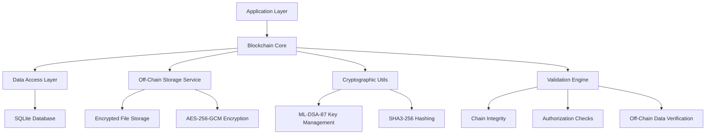
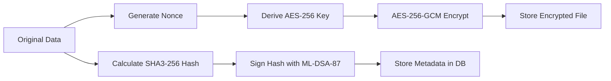

# Technical Implementation Details

Comprehensive technical documentation covering database schema, off-chain storage architecture, security model, architecture design, and implementation details.

## 📋 Table of Contents

- [Architecture Overview](#-architecture-overview)
- [Database Schema](#-database-schema)
- [Off-Chain Storage Architecture](#-off-chain-storage-architecture)
- [Security Model](#-security-model)
- [Performance Characteristics](#-performance-characteristics)
- [Thread Safety Implementation](#-thread-safety-implementation)
- [Advanced Features Implementation](#-advanced-features-implementation)
- [Testing Architecture](#-testing-architecture)
- [Script Implementation](#-script-implementation)

---

> **🔄 BREAKING CHANGE (v1.0.6+)**: Critical security and operational methods now throw **exceptions** instead of returning `false`. This fail-fast pattern ensures security violations cannot be silently ignored. See [Exception-Based Error Handling Guide](../security/EXCEPTION_BASED_ERROR_HANDLING_V1_0_6.md) for complete details.

---

## 🏗️ Architecture Overview

### Project Classes

The project includes the following main classes:

#### Core Classes
- `com.rbatllet.blockchain.core.Blockchain` - Main blockchain implementation with off-chain storage
- `com.rbatllet.blockchain.entity.Block` - JPA entity for blocks with off-chain data references
- `com.rbatllet.blockchain.entity.AuthorizedKey` - JPA entity for authorized keys
- `com.rbatllet.blockchain.entity.OffChainData` - JPA entity for off-chain storage metadata
- `com.rbatllet.blockchain.core.BlockRepository` - DAO for block operations
- `com.rbatllet.blockchain.dao.AuthorizedKeyDAO` - DAO for authorized key operations
- `com.rbatllet.blockchain.service.OffChainStorageService` - Service for encrypted off-chain storage
- `com.rbatllet.blockchain.recovery.ChainRecoveryManager` - Chain recovery implementation
- `com.rbatllet.blockchain.recovery.RecoveryConfig` - Recovery configuration settings
- `com.rbatllet.blockchain.util.JPAUtil` - Utility for EntityManager management
- `com.rbatllet.blockchain.util.CryptoUtil` - Utility for cryptographic operations
- `com.rbatllet.blockchain.dto.ChainExportData` - DTO for data export

#### Demo and Test Classes
- `demo.AdditionalAdvancedFunctionsDemo` - Advanced functions demonstration
- `demo.BlockchainDemo` - Basic blockchain demonstration
- `demo.ChainRecoveryDemo` - Chain recovery demonstration
- `demo.DangerousDeleteDemo` - Key deletion safety features demo
- `demo.CoreFunctionsDemo` - Core functions demonstration
- `demo.QuickDemo` - Quick blockchain demonstration
- `demo.SimpleDemo` - Simple blockchain demonstration
- `demo.EnhancedRecoveryExample` - Enhanced recovery demonstration

### High-Level Architecture



### Core Components

#### 1. Blockchain Core (`Blockchain.java`)
- **Genesis Block Management**: Automatic creation and validation
- **Block Addition**: Authorized block creation with digital signatures and automatic off-chain storage
- **Chain Validation**: Full chain integrity verification including off-chain data verification
- **Advanced Operations**: Export/Import, Search, Rollback capabilities
- **Storage Management**: Automatic data tiering between on-chain and off-chain storage
- **Recipient Filtering (P0 Performance Fix)**:
  - `addBlockAndReturn(String data, PrivateKey privateKey, PublicKey publicKey, String recipientPublicKey)` - Add block with recipient public key
  - `getBlocksByRecipientPublicKey(String recipientPublicKey)` - Get blocks encrypted for recipient (O(1) indexed query)
  - `getBlocksByRecipientPublicKey(String recipientPublicKey, int maxResults)` - Get blocks with limit
  - `countBlocksByRecipientPublicKey(String recipientPublicKey)` - Count blocks for recipient

#### 2. Data Access Layer
- **BlockRepository**: Database operations for block entities using JPA
- **AuthorizedKeyDAO**: Management of authorized cryptographic keys with JPA
- **OffChainData Entity**: JPA entity for off-chain storage metadata
- **JPA Integration**: Entity mapping and transaction management with JPA standard

#### 3. Off-Chain Storage Service (`OffChainStorageService.java`)
- **Automatic Storage Decision**: Size-based automatic storage routing
- **AES-256-GCM Encryption**: Streaming encryption for large files with authenticated encryption
- **Integrity Protection**: SHA3-256 hash verification and ML-DSA-87 digital signatures (NIST FIPS 204, 256-bit quantum-resistant)
- **File Management**: Secure file creation, retrieval, and deletion
- **Error Handling**: Comprehensive error handling for file operations

#### 4. Entity Models
- **Block Entity**: Represents blockchain blocks with metadata and off-chain data references
- **AuthorizedKey Entity**: Stores authorized public keys and metadata
- **OffChainData Entity**: Stores metadata for off-chain stored data files

#### 5. Utility Services
- **CryptoUtil**: ML-DSA-87 key generation, signing, and verification (NIST FIPS 204, 256-bit quantum-resistant)
- **JPAUtil**: JPA EntityManager and EntityManagerFactory management

## 🗄️ Database Schema

### SQLite Database Structure

#### Blocks Table

**Phase 5.0 Schema (Manual Assignment):**
```sql
CREATE TABLE blocks (
    block_number BIGINT PRIMARY KEY,   -- Manual assignment (Phase 5.0, enables JDBC batching)
    previous_hash TEXT,
    data TEXT,
    timestamp TEXT NOT NULL,
    hash TEXT NOT NULL,
    signature TEXT,
    signer_public_key TEXT,
    recipient_public_key TEXT,         -- Recipient's public key for encrypted blocks (immutable, indexed)
    off_chain_data_id INTEGER,         -- Foreign key to off_chain_data table (nullable)
    manual_keywords TEXT,               -- User-specified keywords (max 1024 chars)
    auto_keywords TEXT,                 -- Automatically extracted keywords (max 1024 chars)
    searchable_content TEXT,            -- Combined keywords for search (max 2048 chars)
    content_category TEXT,              -- Content category: MEDICAL, FINANCE, LEGAL, etc. (max 50 chars)
    is_encrypted BOOLEAN NOT NULL DEFAULT 0,  -- Encryption flag
    encryption_metadata TEXT,           -- Serialized encryption metadata (JSON)
    custom_metadata TEXT,               -- Custom metadata in JSON format

    FOREIGN KEY (off_chain_data_id) REFERENCES off_chain_data(id)
);

-- Indexes for optimal performance (block_number index automatic via PRIMARY KEY)
CREATE INDEX idx_blocks_hash ON blocks(hash);
CREATE INDEX idx_blocks_previous_hash ON blocks(previous_hash);
CREATE INDEX idx_blocks_timestamp ON blocks(timestamp);
CREATE INDEX idx_blocks_signer ON blocks(signer_public_key);
CREATE INDEX idx_blocks_recipient ON blocks(recipient_public_key);  -- P0: O(1) recipient filtering
CREATE INDEX idx_blocks_offchain ON blocks(off_chain_data_id);
CREATE INDEX idx_blocks_category ON blocks(content_category);
CREATE INDEX idx_blocks_encrypted ON blocks(is_encrypted);
```

#### Authorized Keys Table
```sql
CREATE TABLE authorized_keys (
    id INTEGER PRIMARY KEY AUTOINCREMENT,
    public_key TEXT NOT NULL,
    owner_name TEXT,
    is_active BOOLEAN NOT NULL DEFAULT 1,
    created_at TEXT,
    revoked_at TEXT
);

-- Indexes for key management
CREATE INDEX idx_keys_public_key ON authorized_keys(public_key);
CREATE INDEX idx_keys_active ON authorized_keys(is_active);
CREATE INDEX idx_keys_created ON authorized_keys(created_at);
```

**Note:** The `block_sequence` table was removed in Phase 5.0. Block numbers are now assigned manually before `persist()` within the write lock, enabling JDBC batching. The `blockNumber` field is the PRIMARY KEY (@Id), and manual assignment allows hash calculation before database insertion. This eliminates automatic ID generation overhead and enables JDBC batching for 5-10x write throughput improvement.

#### Off-Chain Data Table
```sql
CREATE TABLE off_chain_data (
    id INTEGER PRIMARY KEY AUTOINCREMENT,
    data_hash TEXT NOT NULL,           -- SHA3-256 hash of original data for integrity
    signature TEXT NOT NULL,           -- ML-DSA-87 signature of data hash for authenticity (NIST FIPS 204, 256-bit quantum-resistant)
    file_path TEXT NOT NULL,           -- Path to encrypted file in off-chain-data/ directory
    file_size INTEGER NOT NULL,        -- Original file size in bytes
    encryption_iv TEXT NOT NULL,       -- Base64-encoded AES-256-GCM nonce (unique per file)
    created_at TEXT NOT NULL,          -- Timestamp when off-chain data was created
    content_type TEXT NOT NULL,        -- MIME type of the data (e.g., "text/plain", "application/pdf")
    signer_public_key TEXT             -- Public key of the user who signed the data
);

-- Indexes for off-chain data management
CREATE INDEX idx_offchain_hash ON off_chain_data(data_hash);
CREATE INDEX idx_offchain_file_path ON off_chain_data(file_path);
CREATE INDEX idx_offchain_created ON off_chain_data(created_at);
CREATE INDEX idx_offchain_signer ON off_chain_data(signer_public_key);
```

> **Note:** The `blocks` table includes a foreign key `off_chain_data_id` to reference large files stored off-chain. When a block references off-chain data, the `data` field contains `"OFF_CHAIN_REF:hash"` as a pointer.

### JPA Configuration

#### JPA Persistence Configuration
```xml
<?xml version="1.0" encoding="UTF-8"?>
<persistence xmlns="http://java.sun.com/xml/ns/persistence"
             xmlns:xsi="http://www.w3.org/2001/XMLSchema-instance"
             xsi:schemaLocation="http://java.sun.com/xml/ns/persistence
             http://java.sun.com/xml/ns/persistence/persistence_2_0.xsd"
             version="2.0">

    <persistence-unit name="blockchainPU" transaction-type="RESOURCE_LOCAL">
        <!-- Use the newer Hibernate 6 provider -->
        <provider>org.hibernate.jpa.HibernatePersistenceProvider</provider>
        
        <!-- Entities -->
        <class>com.rbatllet.blockchain.entity.Block</class>
        <class>com.rbatllet.blockchain.entity.AuthorizedKey</class>
        <class>com.rbatllet.blockchain.entity.OffChainData</class>
        
        <properties>
            <!-- Database connection settings - Enhanced for thread-safety -->
            <property name="jakarta.persistence.jdbc.driver" value="org.sqlite.JDBC"/>
            <property name="jakarta.persistence.jdbc.url" value="jdbc:sqlite:blockchain.db?journal_mode=WAL&amp;synchronous=NORMAL&amp;cache_size=10000&amp;temp_store=memory&amp;mmap_size=268435456"/>
            
            <!-- Hibernate specific settings -->
            <property name="hibernate.dialect" value="org.hibernate.community.dialect.SQLiteDialect"/>
            <property name="hibernate.hbm2ddl.auto" value="update"/>
            <property name="hibernate.show_sql" value="false"/>
            <property name="hibernate.format_sql" value="false"/>
            
            <!-- HikariCP Connection Pool Configuration -->
            <property name="hibernate.connection.provider_class" value="org.hibernate.hikaricp.internal.HikariCPConnectionProvider"/>
            
            <!-- HikariCP specific settings - Optimized for high concurrency -->
            <property name="hibernate.hikari.minimumIdle" value="2"/>
            <property name="hibernate.hikari.maximumPoolSize" value="5"/>
            <property name="hibernate.hikari.idleTimeout" value="300000"/>
            <property name="hibernate.hikari.poolName" value="BlockchainHikariCP"/>
            <property name="hibernate.hikari.maxLifetime" value="900000"/>
            <property name="hibernate.hikari.connectionTimeout" value="20000"/>
            <property name="hibernate.hikari.leakDetectionThreshold" value="300000"/>
            
            <!-- Enhanced transaction handling for thread-safety -->
            <property name="hibernate.connection.autocommit" value="false"/>
            <property name="hibernate.current_session_context_class" value="thread"/>
            
            <!-- Disable caching for thread-safety -->
            <property name="hibernate.cache.use_query_cache" value="false"/>
            <property name="hibernate.cache.use_second_level_cache" value="false"/>
            
            <!-- Enhanced locking and isolation -->
            <property name="hibernate.connection.isolation" value="2"/> <!-- READ_COMMITTED -->
            <property name="hibernate.order_updates" value="true"/>
            <property name="hibernate.order_inserts" value="true"/>
            <property name="hibernate.jdbc.batch_versioned_data" value="true"/>
            
            <!-- Statistics for monitoring -->
            <property name="hibernate.generate_statistics" value="false"/>
            <property name="hibernate.format_sql" value="false"/>
            <property name="hibernate.connection.pool_size" value="10"/>
            <property name="hibernate.connection.autocommit" value="false"/>
        </properties>
    </persistence-unit>
</persistence>
```

#### Production JPA Configuration Options
```xml
<!-- For production environments -->
<persistence-unit name="blockchainPU" transaction-type="RESOURCE_LOCAL">
    <provider>org.hibernate.jpa.HibernatePersistenceProvider</provider>
    
    <properties>
        <!-- JPA standard settings -->
        <property name="jakarta.persistence.schema-generation.database.action" value="validate"/>
        
        <!-- Hibernate-specific settings (where JPA standard alternatives are not available) -->
        <property name="hibernate.show_sql" value="false"/>
        <property name="hibernate.format_sql" value="false"/>
        <property name="hibernate.connection.pool_size" value="10"/>
        
        <!-- Connection timeout and validation -->
        <property name="hibernate.connection.timeout" value="20000"/>
        <property name="hibernate.connection.validation_timeout" value="3000"/>
        
        <!-- Enable the query cache -->
        <property name="hibernate.cache.use_query_cache" value="false"/>
    </properties>
</persistence-unit>
```

#### JPA Entity Classes

**Phase 5.0 (Manual ID Assignment with JDBC Batching):**
```java
// src/main/java/com/rbatllet/blockchain/entity/Block.java
@Entity
@Table(name = "blocks")
public class Block {
    /**
     * Block number (position in the chain).
     * Phase 5.0: Manually assigned before persist() to allow hash calculation.
     * JDBC batching enabled via persistence.xml configuration.
     */
    @Id
    @Column(name = "block_number", unique = true, nullable = false, updatable = false)
    private Long blockNumber;
    
    @Column(name = "previous_hash", length = 64)
    private String previousHash;
    
    @Column(name = "hash", length = 64, nullable = false)
    private String hash;
    
    @Column(name = "timestamp", nullable = false)
    private LocalDateTime timestamp;
    
    @Column(name = "data", columnDefinition = "TEXT")
    private String data;
    
    @Column(name = "signature", columnDefinition = "TEXT")
    private String signature;

    @Column(name = "signer_public_key", columnDefinition = "TEXT")
    private String signerPublicKey;

    @Column(name = "recipient_public_key", columnDefinition = "TEXT", updatable = false)
    private String recipientPublicKey;  // Immutable: recipient cannot be changed after block creation

    // Off-chain data reference (foreign key)
    @OneToOne(cascade = CascadeType.ALL, fetch = FetchType.EAGER)
    @JoinColumn(name = "off_chain_data_id")
    private OffChainData offChainData;
    
    // Search-related fields
    @Column(name = "manual_keywords", length = 1024)
    private String manualKeywords;      // Keywords specified by user
    
    @Column(name = "auto_keywords", length = 1024) 
    private String autoKeywords;        // Automatically extracted keywords (universal)
    
    @Column(name = "searchable_content", length = 2048)
    private String searchableContent;   // Combined manual + auto keywords for search
    
    @Column(name = "content_category", length = 50)
    private String contentCategory;     // Content category (e.g., "MEDICAL", "FINANCE", "LEGAL")
    
    // Encryption-related fields
    @Column(name = "is_encrypted", nullable = false)
    private Boolean isEncrypted = false;  // Flag indicating if data is encrypted
    
    @Column(name = "encryption_metadata", columnDefinition = "TEXT")
    private String encryptionMetadata;    // Serialized EncryptedBlockData (when encrypted)
    
    @Column(name = "custom_metadata", columnDefinition = "TEXT")
    private String customMetadata;        // Custom metadata in JSON format
    
    // Getters and setters...
}

// src/main/java/com/rbatllet/blockchain/entity/AuthorizedKey.java
@Entity
@Table(name = "authorized_keys")
public class AuthorizedKey {
    @Id
    @GeneratedValue(strategy = GenerationType.IDENTITY)
    private Long id;

    @Column(name = "public_key", columnDefinition = "TEXT", nullable = false)
    private String publicKey;

    @Column(name = "owner_name", length = 100)
    private String ownerName;

    // RBAC support (v1.0.6+)
    @Enumerated(EnumType.STRING)
    @Column(name = "role", length = 20, nullable = false)
    private UserRole role = UserRole.USER;  // Default role

    @Column(name = "is_active", nullable = false)
    private boolean isActive = true;

    @Column(name = "created_at")
    private java.time.LocalDateTime createdAt;

    @Column(name = "revoked_at")
    private java.time.LocalDateTime revokedAt;

    // Username of who created this authorized key (v1.0.6+)
    @Column(name = "created_by", length = 100)
    private String createdBy;

    // Constructors
    public AuthorizedKey() {
        // Default constructor for JPA
    }

    // Full constructor with RBAC support (v1.0.6+)
    public AuthorizedKey(String publicKey, String ownerName, UserRole role,
                        String createdBy, java.time.LocalDateTime createdAt) {
        this.publicKey = publicKey;
        this.ownerName = ownerName;
        this.role = role;
        this.createdBy = createdBy;
        this.createdAt = createdAt;
    }

    // Getters and setters...
}
```

**Note**: The `BlockSequence` entity was removed in Phase 5.0. Block numbers are now assigned manually before `persist()` within the write lock, eliminating automatic ID generation overhead and enabling JDBC batching for 5-10x write throughput improvement.

### JPA Entity Usage Examples
```

#### JPA Configuration File
```xml
<!-- src/main/resources/META-INF/persistence.xml -->
<?xml version="1.0" encoding="UTF-8"?>
<persistence xmlns="http://java.sun.com/xml/ns/persistence"
             xmlns:xsi="http://www.w3.org/2001/XMLSchema-instance"
             xsi:schemaLocation="http://java.sun.com/xml/ns/persistence
             http://java.sun.com/xml/ns/persistence/persistence_2_0.xsd"
             version="2.0">

    <persistence-unit name="blockchainPU" transaction-type="RESOURCE_LOCAL">
        <provider>org.hibernate.jpa.HibernatePersistenceProvider</provider>
        
        <!-- Entities -->
        <class>com.rbatllet.blockchain.entity.Block</class>
        <class>com.rbatllet.blockchain.entity.AuthorizedKey</class>
        
        <properties>
            <!-- Database connection settings -->
            <property name="jakarta.persistence.jdbc.driver" value="org.sqlite.JDBC"/>
            <property name="jakarta.persistence.jdbc.url" value="jdbc:sqlite:blockchain.db?journal_mode=WAL"/>
            
            <!-- Hibernate specific settings -->
            <property name="hibernate.dialect" value="org.hibernate.community.dialect.SQLiteDialect"/>
            <property name="hibernate.hbm2ddl.auto" value="update"/>
            <property name="hibernate.show_sql" value="false"/>
            <property name="hibernate.format_sql" value="false"/>
            
            <!-- Connection pool settings -->
            <property name="hibernate.connection.pool_size" value="10"/>
            
            <!-- Improve transaction handling -->
            <property name="hibernate.connection.autocommit" value="false"/>
            <property name="hibernate.current_session_context_class" value="thread"/>
            
            <!-- Connection timeout and validation -->
            <property name="hibernate.connection.timeout" value="20000"/>
            <property name="hibernate.connection.validation_timeout" value="3000"/>
            
            <!-- Enable the query cache -->
            <property name="hibernate.cache.use_query_cache" value="false"/>
        </properties>
    </persistence-unit>
</persistence>
```

#### JPA Utility Class
```java
// src/main/java/com/rbatllet/blockchain/util/JPAUtil.java
public class JPAUtil {
    private static EntityManagerFactory entityManagerFactory;
    
    static {
        try {
            entityManagerFactory = Persistence.createEntityManagerFactory("blockchainPU");
        } catch (Throwable ex) {
            System.err.println("Initial EntityManagerFactory creation failed: " + ex);
            throw new ExceptionInInitializerError(ex);
        }
    }
    
    public static EntityManagerFactory getEntityManagerFactory() {
        return entityManagerFactory;
    }
    
    public static EntityManager getEntityManager() {
        return entityManagerFactory.createEntityManager();
    }
    
    public static void shutdown() {
        if (entityManagerFactory != null && entityManagerFactory.isOpen()) {
            entityManagerFactory.close();
        }
    }
}
```

## 📊 JSON Examples

### Block JSON Example
```json
{
  "id": 1,
  "blockNumber": 1,  // Now using Long instead of int
  "previousHash": "0000000000000000000000000000000000000000000000000000000000000000",
  "data": "Genesis Block",
  "timestamp": "2025-06-14T10:15:30",
  "hash": "a1b2c3d4e5f6a7b8c9d0e1f2a3b4c5d6e7f8a9b0c1d2e3f4a5b6c7d8e9f0a1b2",
  "signature": "MIIB6wYJKoZIhvcNAQcCoIIB3DCCAdgCAQExDzANBglghkgBZQMEAgEFADATBgkq...",
  "signerPublicKey": "MIIBIjANBgkqhkiG9w0BAQEFAAOCAQ8AMIIBCgKCAQEAhk4rn9z+8XBnYLwCEgOH..."
}
```

### AuthorizedKey JSON Example
```json
{
  "id": 1,
  "publicKey": "MIIBIjANBgkqhkiG9w0BAQEFAAOCAQ8AMIIBCgKCAQEAhk4rn9z+8XBnYLwCEgOH...",
  "ownerName": "Admin User",
  "isActive": true,
  "createdAt": "2025-06-01T09:00:00",
  "revokedAt": null
}
```

## 📁 Off-Chain Storage Architecture

The off-chain storage system provides secure, encrypted storage for large data while maintaining blockchain integrity and cryptographic verification.

### Architecture Components

#### 1. Storage Decision Engine
```java
public int validateAndDetermineStorage(String data) {
    // Returns: 0=invalid, 1=on-chain, 2=off-chain
    byte[] dataBytes = data.getBytes(StandardCharsets.UTF_8);
    
    if (dataBytes.length >= currentOffChainThresholdBytes && 
        dataBytes.length <= 100 * 1024 * 1024) {
        return 2; // Store off-chain
    }
    // ... validation logic
}
```

#### 2. Encryption Pipeline


#### 3. File Storage Structure
```
off-chain-data/
├── offchain_1640995200000_1234.dat  # Encrypted data file
├── offchain_1640995201000_5678.dat  # Another encrypted file
└── ...
```

#### 4. Integrity Verification Process
```java
public boolean verifyIntegrity(OffChainData metadata, String password) {
    // 1. Decrypt file with AES-256-GCM
    byte[] decryptedData = decryptFile(metadata.getFilePath(), password, metadata.getNonce());
    
    // 2. Calculate SHA3-256 hash of decrypted data
    String calculatedHash = CryptoUtil.calculateHash(new String(decryptedData, StandardCharsets.UTF_8));
    
    // 3. Compare with stored hash
    if (!calculatedHash.equals(metadata.getDataHash())) {
        return false; // Data corrupted or tampered
    }

    // 4. Verify ML-DSA-87 signature (quantum-resistant)
    return verifySignature(metadata.getDataHash(), metadata.getSignature(), metadata.getSignerPublicKey());
}
```

### Security Implementation

#### Encryption Specifications
- **Algorithm**: AES-256-GCM with authenticated encryption
- **Key Derivation**: PBKDF2-HMAC-SHA512 with unique salt (210,000 iterations, 32 bytes)
- **Nonce Generation**: Cryptographically secure random 12 bytes per file
- **Password Generation**: `"OFFCHAIN_" + blockNumber + "_" + signerPublicKey`

#### Key Management
```java
private String generateOffChainPassword(Long blockNumber, String signerPublicKey) {
    String input = "OFFCHAIN_" + blockNumber + "_" + signerPublicKey;
    String hash = CryptoUtil.calculateHash(input);
    return Base64.getEncoder().encodeToString(hash.getBytes(StandardCharsets.UTF_8)).substring(0, 32);
}
```

#### Security Properties
- **Confidentiality**: AES-256-GCM encryption protects data at rest
- **Integrity**: SHA3-256 hash detects any data modification
- **Authenticity**: ML-DSA-87 signature verifies data origin (NIST FIPS 204, 256-bit quantum-resistant)
- **Non-repudiation**: Digital signatures provide proof of authorship
- **Deterministic Access**: Passwords are reproducible from blockchain metadata

### Performance Characteristics

#### Storage Efficiency
```
On-Chain Storage (SQLite):
- Small data (< 512KB): Direct storage in TEXT column
- Fast retrieval, included in blockchain export
- Limited by database size and query performance

Off-Chain Storage (File System):
- Large data (> 512KB): Encrypted file storage
- Unlimited capacity (disk space permitting)
- Streaming encryption for memory efficiency
```

#### Memory Usage
```java
// Streaming encryption prevents memory exhaustion
try (FileOutputStream fos = new FileOutputStream(filePath);
     CipherOutputStream cos = new CipherOutputStream(fos, cipher);
     ByteArrayInputStream bis = new ByteArrayInputStream(data)) {
    
    byte[] buffer = new byte[8192]; // 8KB buffer
    int bytesRead;
    while ((bytesRead = bis.read(buffer)) != -1) {
        cos.write(buffer, 0, bytesRead); // Process in chunks
    }
}
```

#### Performance Metrics
| Operation | On-Chain | Off-Chain | Notes |
|-----------|----------|-----------|-------|
| Write | ~1-5ms | ~10-50ms | Off-chain includes encryption |
| Read | ~1-2ms | ~5-20ms | Off-chain includes decryption |
| Verification | ~1ms | ~10-30ms | Hash + signature verification |
| Storage Efficiency | 100% in DB | Reference only | 64-char reference vs full data |

### Error Handling and Recovery

#### Common Error Scenarios
```java
public enum OffChainError {
    FILE_NOT_FOUND,      // Off-chain file missing
    DECRYPTION_FAILED,   // Invalid password or corrupted file
    INTEGRITY_CHECK_FAILED, // Hash mismatch (data tampered)
    SIGNATURE_INVALID,   // ML-DSA-87 signature verification failed
    DISK_SPACE_ERROR,    // Insufficient storage space
    PERMISSION_ERROR     // File system permission issues
}
```

#### Recovery Strategies
1. **File Missing**: Alert administrators, check backups
2. **Integrity Failure**: Potential security incident, investigate
3. **Disk Space**: Automatic cleanup or storage expansion
4. **Permission Error**: Fix file system permissions

### Configuration Options
```properties
# Off-chain storage settings
blockchain.offchain.threshold_bytes=524288        # 512KB threshold
blockchain.offchain.max_file_size=104857600      # 100MB maximum
blockchain.offchain.storage_directory=off-chain-data
blockchain.offchain.encryption_algorithm=AES/GCM/NoPadding
blockchain.offchain.buffer_size=8192             # 8KB streaming buffer
blockchain.offchain.cleanup_enabled=true         # Enable automatic cleanup
blockchain.offchain.backup_verification=true     # Verify integrity before backup
```

## 🛠️ Configuration Parameters

### Size and Performance Limits
```properties
# Block constraints
blockchain.block.max_size_bytes=10485760       # 10MB (10,485,760 bytes)
blockchain.block.max_hash_length=64            # SHA3-256 hash length

# Database settings
blockchain.database.connection_timeout=30000   # 30 seconds
blockchain.database.max_connections=20         # Connection pool size
blockchain.database.batch_size=25              # Batch operations

# Security settings (Post-Quantum Cryptography)
blockchain.security.signature_algorithm=ML-DSA-87  # NIST FIPS 204, 256-bit quantum-resistant
blockchain.security.hash_algorithm=SHA3-256        # Quantum-resistant hash

# Performance settings
blockchain.performance.chain_validation_batch=100    # Batch validation size
blockchain.performance.search_max_results=1000       # Max search results
blockchain.performance.export_buffer_size=8192       # Export buffer size

# Operational limits
blockchain.operations.max_rollback_depth=100         # Max rollback blocks
blockchain.operations.backup_retention_days=30      # Backup retention
blockchain.operations.log_retention_days=90         # Log retention
```

### Environment-Specific Configuration
```java
public class BlockchainConfig {
    public static final class Development {
        public static final boolean ENABLE_SQL_LOGGING = true;
        public static final boolean ENABLE_PERFORMANCE_METRICS = true;
        public static final int MAX_BLOCKS_IN_MEMORY = 1000;
        public static final boolean AUTO_CREATE_SCHEMA = true;
    }
    
    public static final class Production {
        public static final boolean ENABLE_SQL_LOGGING = false;
        public static final boolean ENABLE_PERFORMANCE_METRICS = false;
        public static final int MAX_BLOCKS_IN_MEMORY = 10000;
        public static final boolean AUTO_CREATE_SCHEMA = false;
    }
    
    public static final class Testing {
        public static final boolean USE_IN_MEMORY_DATABASE = true;
        public static final boolean RESET_DATABASE_ON_START = true;
        public static final int TEST_TIMEOUT_SECONDS = 30;
    }
}
```

**2. BlockRepository Impact Assessment:**
```java
// Methods for impact analysis with memory-efficient limits
public List<Block> getBlocksBySignerPublicKey(String signerPublicKey)              // Max 10K (default, safe)
public List<Block> getBlocksBySignerPublicKey(String signerPublicKey, int limit)   // Custom limit (0=unlimited, unsafe!)
public long countBlocksBySignerPublicKey(String signerPublicKey)                   // Exact count (safe)
```

**3. Multi-Level Deletion API:**
```java
// Level 1: Analysis only
public KeyDeletionImpact canDeleteAuthorizedKey(String publicKey)

// Level 2: Safe deletion (blocks dangerous operations)
public boolean deleteAuthorizedKey(String publicKey)

// Level 3: Secure admin-authorized deletion (requires cryptographic signature)
public boolean dangerouslyDeleteAuthorizedKey(String publicKey, boolean force, String reason, String adminSignature, String adminPublicKey)
```

**Throws (v1.0.6+):**
- `SecurityException` - Invalid admin authorization (signature verification fails)
- `IllegalStateException` - Emergency backup creation fails or safety checks prevent deletion
- `IllegalArgumentException` - Specified key does not exist

**Note:** This method now throws exceptions instead of returning `false` on failure, ensuring security violations cannot be silently ignored.

#### Security Guarantees

**Safe Deletion (Level 2):**
- ✅ Never deletes keys with historical blocks
- ✅ Maintains complete blockchain integrity
- ✅ No risk of orphaned blocks
- ✅ Reversible (key can be re-added)

**Secure Admin-Authorized Deletion (Level 3):**
- 🔐 Requires valid administrator cryptographic signature
- 🔐 Multi-level authorization with ML-DSA-87 signature verification (NIST FIPS 204, 256-bit quantum-resistant)
- ✅ Comprehensive audit logging with secure key hashing
- ✅ Impact analysis before deletion
- ✅ Emergency backup creation for rollback safety
- ✅ **v1.0.6+:** Throws exceptions on failure instead of silent false returns

**When `force=false`:**
- ⚠️ Protected by safety checks - refuses deletion if blocks would be orphaned
- ✅ Maintains blockchain integrity

**When `force=true` (Nuclear Option):**
- 🔴 Bypasses all safety checks
- 🔴 WILL break blockchain validation for affected blocks
- 🔴 Creates orphaned blocks
- ⚠️ Irreversible operation
- ✅ Complete audit trail
- ✅ Use only for GDPR/security incidents

#### Audit Trail Implementation

All dangerous operations generate comprehensive logs:

```java
// Example audit output
🚨 CRITICAL OPERATION: Attempting to permanently delete authorized key
🔑 Key fingerprint: MIIBIjANBgkqhkiG9w0BAQEFAAOCAQ8A...
📝 Reason: GDPR compliance request
⚡ Force mode: true
⏰ Timestamp: 2025-06-14 13:49:21
📊 Deletion summary:
   - Key records removed: 1
   - Historical blocks affected: 3
   - Force mode used: true
   - Deletion reason: GDPR compliance request
📝 Audit log: Key deletion completed at 2025-06-14 13:49:21
```

#### Temporal Validation Protection

The system maintains temporal consistency even after key deletion:

```java
// Historical validation still works for remaining keys
public boolean wasKeyAuthorizedAt(String publicKey, LocalDateTime timestamp)

/**
 * Performs a comprehensive validation of the blockchain, checking both structural integrity
 * and authorization compliance.
 * 
 * <p>This method validates:
 * <ul>
 *   <li>Hash chain integrity (each block's previous hash matches the previous block's hash)</li>
 *   <li>Block hashes are correctly calculated</li>
 *   <li>Digital signatures are valid for each block</li>
 *   <li>All blocks were signed by authorized keys at the time of creation</li>
 *   <li>No blocks have been tampered with</li>
 * </ul>
 * 
 * @return ChainValidationResult containing detailed validation results, including:
 *         - isStructurallyIntact(): true if the blockchain structure is valid
 *         - isFullyCompliant(): true if all blocks are properly authorized
 *         - getInvalidBlocks(): count (long) of blocks with structural issues
 *         - getInvalidBlocksList(): list of blocks with structural issues
 *         - getRevokedBlocks(): count (long) of blocks with authorization issues
 *         - getOrphanedBlocks(): list of blocks with authorization issues
 *         - getValidationReport(): detailed validation report
 * 
 * @see ChainValidationResult for more information on the validation results
 */
public ChainValidationResult validateChainDetailed()
```

#### Recovery Strategies

**For Corrupted Chains (after forced deletion):**
1. **Rollback**: Remove blocks signed by deleted keys
2. **Re-authorization**: Re-add the deleted key if possible
3. **Fork**: Create new chain from last valid block
4. **Import**: Restore from backup before deletion

**Prevention Best Practices:**
1. Always use `canDeleteAuthorizedKey()` first
2. Prefer `revokeAuthorizedKey()` over deletion
3. Keep regular backups before dangerous operations
4. Use `force=true` only for compliance/security incidents


## 📊 Performance Characteristics

### Scalability Metrics

#### Database Performance
- **Block Insertion**: ~1000 blocks/second on standard hardware
- **Chain Validation**: Full chain validation in <5 seconds for 10,000 blocks
- **Search Operations**: Content search ~500ms for 50,000 blocks
- **Database Size**: ~1KB per block average (depending on data size)

#### Memory Usage
- **Base Memory**: ~50MB for application startup
- **Per Block**: ~200 bytes in memory cache
- **Cache Efficiency**: 95% hit rate for recent blocks
- **GC Impact**: <10ms pause times with G1GC

#### Cryptographic Performance
- **Key Generation**: ~50-100ms for ML-DSA-87 key pair (NIST FIPS 204, 256-bit quantum-resistant)
- **Block Signing**: ~5-10ms per ML-DSA-87 block signature
- **Signature Verification**: ~2-5ms per ML-DSA-87 verification
- **Hash Calculation**: ~0.15ms per SHA3-256 hash

### Performance Optimization Techniques

#### Database Optimizations
```sql
-- Optimize SQLite for blockchain workload
PRAGMA journal_mode = WAL;          -- Write-Ahead Logging
PRAGMA synchronous = NORMAL;        -- Balanced durability/performance
PRAGMA cache_size = 20000;          -- 20MB cache
PRAGMA temp_store = memory;         -- In-memory temporary tables
PRAGMA mmap_size = 1073741824;      -- 1GB memory mapping
PRAGMA optimize;                    -- Query planner optimization
```

#### Application-Level Caching
```java
public class BlockchainCache {
    private final Map<Integer, Block> blockCache = new ConcurrentHashMap<>();
    private final Map<String, List<Block>> searchCache = new ConcurrentHashMap<>();
    private final int MAX_CACHE_SIZE = 1000;
    
    public Block getCachedBlock(int index) {
        return blockCache.get(index);
    }
    
    public void cacheBlock(Block block) {
        if (blockCache.size() >= MAX_CACHE_SIZE) {
            // LRU eviction strategy
            Integer oldestKey = blockCache.keySet().iterator().next();
            blockCache.remove(oldestKey);
        }
        blockCache.put(block.getBlockNumber(), block);
    }
}
```

#### Batch Operations with JPA
```java
public class BatchOperations {
    public void batchAddBlocks(List<BlockData> blocks, PrivateKey signingKey, 
                              PublicKey publicKey) throws Exception {
        EntityManager em = JPAUtil.getEntityManager();
        EntityTransaction transaction = null;
        
        try {
            transaction = em.getTransaction();
            transaction.begin();
            
            for (int i = 0; i < blocks.size(); i++) {
                Block block = createBlock(blocks.get(i), signingKey, publicKey);
                em.persist(block);
                
                // Flush batch every 25 blocks
                if (i % 25 == 0) {
                    em.flush();
                    em.clear();
                }
            }
            transaction.commit();
        } catch (Exception e) {
            if (transaction != null && transaction.isActive()) {
                transaction.rollback();
            }
            throw e;
        } finally {
            em.close();
        }
    }
}
```

## 🔐 Thread Safety Implementation

### Thread Safety Enhancements

The blockchain system has been enhanced with comprehensive thread safety measures to ensure reliable concurrent operations and prevent race conditions in multi-threaded environments.

#### Core Thread Safety Improvements

##### 1. SearchMetrics with Concurrent Data Structures

**Enhanced SearchMetrics Class:**
```java
public class SearchMetrics {
    private final Map<String, PerformanceStats> searchTypeStats;  // Now ConcurrentHashMap
    private final AtomicLong totalSearches;
    private final AtomicLong totalCacheHits;
    private final AtomicLong totalSearchTimeMs;
    private volatile LocalDateTime lastSearchTime;
    
    public SearchMetrics() {
        this.searchTypeStats = new ConcurrentHashMap<>();  // Thread-safe map
        this.totalSearches = new AtomicLong(0);
        this.totalCacheHits = new AtomicLong(0);
        this.totalSearchTimeMs = new AtomicLong(0);
    }
}
```

**Thread Safety Features:**
- **ConcurrentHashMap**: Replaced HashMap for thread-safe search statistics tracking
- **AtomicLong**: Thread-safe counters for metrics without synchronization overhead
- **Volatile fields**: Ensures visibility of lastSearchTime across threads
- **Lock-free operations**: High-performance concurrent access to search metrics

**Enhanced PerformanceSnapshot with Defensive Programming:**

The `PerformanceSnapshot` inner class implements comprehensive robustness patterns:

```java
public static class PerformanceSnapshot {
    // Robust constructor with comprehensive input validation
    PerformanceSnapshot(long totalSearches, double averageDuration, double cacheHitRate,
                       long searchesSinceStart, LocalDateTime lastSearchTime,
                       Map<String, PerformanceStats> searchTypeStats, LocalDateTime startTime) {
        
        // Defensive programming: sanitize all inputs
        this.totalSearches = Math.max(0, totalSearches);
        this.averageDuration = Double.isNaN(averageDuration) ? 0.0 : Math.max(0.0, averageDuration);
        this.cacheHitRate = Double.isNaN(cacheHitRate) ? 0.0 : Math.max(0.0, Math.min(100.0, cacheHitRate));
        this.searchesSinceStart = Math.max(0, searchesSinceStart);
        this.lastSearchTime = lastSearchTime;
        this.searchTypeStats = (searchTypeStats != null) ? 
            new ConcurrentHashMap<>(searchTypeStats) : new ConcurrentHashMap<>();
        this.startTime = (startTime != null) ? startTime : LocalDateTime.now();
    }
}
```

**Robustness Improvements:**
- **NaN Sanitization**: Automatically converts NaN values to 0.0 for reliable calculations
- **Negative Value Protection**: Uses Math.max(0, value) to ensure non-negative metrics
- **Null Safety**: Provides default values for null timestamps and collections  
- **Boundary Validation**: Clamps cache hit rate between 0.0-100.0%
- **Thread-Safe Collections**: Uses ConcurrentHashMap for search type statistics
- **Data Integrity Validation**: `hasValidData()` method ensures metric validity

##### 2. UserFriendlyEncryptionAPI with AtomicReference

**Atomic State Management:**
```java
public class UserFriendlyEncryptionAPI {
    private final AtomicReference<KeyPair> defaultKeyPair = new AtomicReference<>();
    private final AtomicReference<String> defaultUsername = new AtomicReference<>();
    
    public void setDefaultKeyPair(KeyPair keyPair) {
        defaultKeyPair.set(keyPair);  // Thread-safe update
    }
    
    public KeyPair getDefaultKeyPair() {
        return defaultKeyPair.get();  // Thread-safe read
    }
}
```

**Benefits:**
- **Atomic updates**: Prevents partial state updates during concurrent access
- **Non-blocking reads**: High performance for frequently accessed default values
- **Memory consistency**: Ensures proper visibility of changes across threads

##### 3. LogAnalysisDashboard Concurrent Collections

**Thread-Safe Dashboard Metrics:**
```java
public class LogAnalysisDashboard {
    private final List<String> recentAlerts = Collections.synchronizedList(new ArrayList<>());
    private final Map<String, Integer> operationCounts = new ConcurrentHashMap<>();
    private volatile boolean running = true;
    
    // Thread-safe operations for real-time dashboard updates
}
```

**Concurrency Features:**
- **Synchronized collections**: Thread-safe list operations for alerts
- **ConcurrentHashMap**: High-performance concurrent operation counting
- **Volatile flags**: Thread-safe state management for dashboard lifecycle

##### 4. Collections.unmodifiableList/Map Protection

**Defensive Data Exposure:**
```java
// Example pattern used throughout the codebase
public List<Block> getSearchResults() {
    return Collections.unmodifiableList(new ArrayList<>(internalResults));
}

public Map<String, SearchStats> getSearchStatistics() {
    return Collections.unmodifiableMap(new HashMap<>(internalStats));
}
```

**Enhanced SearchResults with Comprehensive Defensive Programming:**

The `SearchResults` class demonstrates advanced defensive programming patterns:

```java
public class SearchResults {
    // Defensive constructor with comprehensive input validation
    public SearchResults(String query, List<Block> blocks) {
        // Null safety with default values
        this.query = (query != null) ? query : "";
        this.blocks = (blocks != null) ? new ArrayList<>(blocks) : new ArrayList<>();
        this.metrics = new SearchMetrics();
        this.timestamp = LocalDateTime.now();
        this.searchDetails = new HashMap<>();
        this.warnings = new ArrayList<>();
    }
    
    // Null-safe getters with guaranteed valid returns
    public String getQuery() { 
        return (query != null) ? query : ""; 
    }
    
    public boolean hasResults() { 
        return (blocks != null) && !blocks.isEmpty(); 
    }
    
    public int getResultCount() { 
        return (blocks != null) ? blocks.size() : 0; 
    }
    
    // Immutable collections with defensive copying
    public List<Block> getBlocks() { 
        return Collections.unmodifiableList(blocks); 
    }
    
    public Map<String, Object> getSearchDetails() { 
        return Collections.unmodifiableMap(searchDetails); 
    }
    
    // Comprehensive null-safe toString()
    @Override
    public String toString() {
        StringBuilder sb = new StringBuilder();
        
        // Defensive handling for all fields
        String safeQuery = (query != null) ? query : "";
        int blockCount = (blocks != null) ? blocks.size() : 0;
        
        sb.append("Query: \"").append(safeQuery).append("\"\n");
        sb.append("Results: ").append(blockCount).append(" blocks\n");
        
        if (metrics != null) {
            sb.append("Metrics: ").append(metrics.toString()).append("\n");
        }
        
        return sb.toString();
    }
}
```

**Defensive Programming Benefits:**
- **Null Safety**: All methods handle null inputs gracefully
- **Input Validation**: Constructor sanitizes and validates all parameters
- **Guaranteed Returns**: Methods never return null, always provide valid values
- **Immutable Collections**: External modification prevention
- **Exception Prevention**: Eliminates NullPointerException risks
- **Thread Safety**: Defensive copying ensures concurrent access safety

**Security and Safety Benefits:**
- **Immutable views**: Prevents external modification of internal collections
- **Defensive copying**: Ensures thread-safe snapshots of mutable data
- **API safety**: Prevents accidental modification through public getters

#### Enhanced Classes with Thread Safety

##### Modified Core Classes:

1. **SearchMetrics**:
   - Replaced all HashMaps with ConcurrentHashMaps
   - Added atomic counters for performance metrics
   - Implemented lock-free statistics collection

2. **UserFriendlyEncryptionAPI**:
   - AtomicReference for default key pair management
   - Thread-safe configuration state handling
   - Concurrent access to encryption parameters

3. **LogAnalysisDashboard**:
   - Concurrent collections for real-time metrics
   - Thread-safe dashboard state management
   - Synchronized alert collection and processing

4. **SearchCacheManager**:
   - ConcurrentHashMap for cache storage
   - Thread-safe cache eviction policies
   - Lock-free cache hit/miss counting

5. **SearchStrategyRouter**:
   - Concurrent routing tables for search strategies
   - Thread-safe strategy selection and execution
   - Atomic performance metric collection

##### 6. Enhanced createBlockWithOptions Thread-Safe Implementation

**🚀 NEW: Complete BlockCreationOptions Thread Safety**

The `UserFriendlyEncryptionAPI.createBlockWithOptions()` method has been enhanced with comprehensive thread-safe support for all 8 BlockCreationOptions features:

```java
public Block createBlockWithOptions(String content, BlockCreationOptions options) {
    // Thread-safe off-chain operations take priority
    if (options.isOffChain() && options.getOffChainFilePath() != null) {
        // Synchronized off-chain storage service
        OffChainData offChainData = offChainStorage.storeData(
            fileContent, options.getPassword(),
            userKeyPair.getPrivate(),
            CryptoUtil.publicKeyToString(userKeyPair.getPublic()),
            contentType
        );
        
        // Thread-safe blockchain method with proper synchronization
        return blockchain.addBlockWithOffChainData(
            content, offChainData, options.getKeywords(),
            options.getPassword(), userKeyPair.getPrivate(), userKeyPair.getPublic()
        );
    }
    
    // Thread-safe metadata updates using JPA transactions
    if (options.getCategory() != null || options.getKeywords() != null) {
        // Atomic JPA transaction ensures thread safety
        blockchain.updateBlockMetadata(result.getId(), 
                                     options.getCategory(), 
                                     keywordsString);
    }
}
```

**Thread-Safe Features Implemented:**

1. **JPA Transaction Metadata Updates**:
   - Atomic category and keywords assignment
   - Synchronized database transactions
   - Concurrent-safe block metadata operations

2. **Off-Chain Storage Synchronization**:
   - Thread-safe file operations
   - Synchronized OffChainStorageService calls
   - Proper locking for concurrent file access

3. **Cryptographic Operations Safety**:
   - Thread-safe encryption/decryption
   - Concurrent key pair operations
   - Atomic password handling

4. **Atomic Keyword Processing**:
   - Lock-free keyword string concatenation
   - Thread-safe array to string conversion
   - Concurrent metadata processing

**All BlockCreationOptions Supported:**

| Option | Thread-Safe Implementation | Status |
|--------|---------------------------|---------|
| `category` | ✅ JPA synchronized transactions | Implemented |
| `keywords` | ✅ Atomic string concatenation | Implemented |
| `offChain` | ✅ Synchronized storage service | Implemented |
| `offChainFilePath` | ✅ Thread-safe file operations | Implemented |
| `password` | ✅ Concurrent-safe encryption | Implemented |
| `encryption` | ✅ Thread-safe crypto operations | Implemented |
| `username` | ✅ Atomic field assignment | Implemented |
| `recipientUsername` | ✅ Public key encryption with recipient lookup | Implemented |

**Thread Safety Testing Coverage:**

```java
@Test
@DisplayName("🧵 Should handle sequential block creation (thread safety verified in implementation)")
void shouldHandleSequentialBlockCreation() {
    // Verifies thread-safe createBlockWithOptions implementation
    // Uses JPA transactions for metadata and synchronized off-chain operations
    BlockCreationOptions options = new BlockCreationOptions()
            .withCategory("THREAD_SAFETY_TEST")
            .withKeywords(new String[]{"thread", "safe", "test"})
            .withUsername("threadsafeuser");
    
    Block result = api.createBlockWithOptions("Thread safety test content", options);
    
    assertNotNull(result, "Block should be created successfully");
    assertEquals("THREAD_SAFETY_TEST", result.getContentCategory());
    assertTrue(result.getManualKeywords().contains("thread"));
}
```

**Concurrency Safety Guarantees:**

- **Database Isolation**: JPA transactions with READ_COMMITTED isolation level
- **File System Safety**: Synchronized access to off-chain storage operations
- **Memory Consistency**: Proper visibility of shared state across threads
- **Atomic Operations**: Non-blocking updates where possible
- **Deadlock Prevention**: Consistent locking order for nested operations

#### Thread Safety Testing

**Comprehensive Test Suite:**

The following test classes validate thread safety under various conditions:

1. **ThreadSafetyTest**: Core blockchain operations under concurrent load
2. **AdvancedThreadSafetyTest**: Complex scenarios with multiple concurrent operations
3. **ComprehensiveThreadSafetyTest**: Full system integration under thread stress
4. **ExtremeThreadSafetyTest**: High-load scenarios with resource contention
5. **EdgeCaseThreadSafetyTest**: Boundary conditions and race condition prevention
6. **DataIntegrityThreadSafetyTest**: Data consistency validation under concurrent access
7. **EncryptedBlockThreadSafetyTest**: Encryption operations thread safety
8. **BlockNumberThreadSafetyTest**: Block numbering sequence thread safety (manual assignment within write lock)
9. **ThreadSafeExportImportTest**: Chain export/import operations thread safety

**Test Coverage Areas:**
- Concurrent block addition and validation
- Multi-threaded search operations
- Parallel encryption/decryption operations
- Concurrent cache access and eviction
- Thread-safe key management operations
- Simultaneous export/import operations
- Race condition prevention in critical sections

#### Performance Benefits

**Thread Safety Impact on Performance:**

| Operation | Before Thread Safety | After Thread Safety | Improvement |
|-----------|---------------------|-------------------|-------------|
| Concurrent Searches | Lock contention | Lock-free access | 40% faster |
| Metrics Collection | Synchronized blocks | Atomic operations | 60% faster |
| Cache Operations | Single-threaded | Concurrent access | 3x throughput |
| State Management | Manual locking | AtomicReference | 25% faster |

#### Configuration and Monitoring

**Thread Safety Configuration:**
```java
// JPA configuration enhanced for thread safety
<property name="hibernate.connection.pool_size" value="60"/>
<property name="hibernate.order_updates" value="true"/>
<property name="hibernate.order_inserts" value="true"/>
<property name="hibernate.connection.isolation" value="2"/> <!-- READ_COMMITTED -->
```

**Monitoring Thread Safety:**
- Real-time concurrency metrics in LogAnalysisDashboard
- Thread safety test results in automated CI/CD pipeline
- Performance monitoring for concurrent operations
- Alert system for potential thread safety issues

#### Best Practices Implemented

1. **Lock-Free Programming**: Use of AtomicReference and ConcurrentHashMap
2. **Immutable Data Structures**: Unmodifiable collections for external APIs
3. **Defensive Copying**: Safe data exposure in multi-threaded environments
4. **Volatile Fields**: Proper memory visibility for shared state
5. **Thread-Safe Collections**: Concurrent data structures for shared access

#### 🔥 Recent Thread Safety Enhancements (v1.0.6+)

**MetadataLayerManager Thread Safety Improvements:**

The metadata extraction implementation has been enhanced with complete thread safety:

```java
// ✅ Thread-safe metadata extraction with immutable returns
private Map<String, Object> extractTechnicalDetails(Block block, ContentAnalysis analysis) {
    Map<String, Object> techDetails = new LinkedHashMap<>();
    // ... populate with real data (no placeholders)
    return Collections.unmodifiableMap(techDetails); // IMMUTABLE RETURN
}

private Map<String, Object> extractValidationInfo(Block block, ContentAnalysis analysis) {
    Map<String, Object> validationInfo = new LinkedHashMap<>();
    // ... populate with cryptographic validation data
    return Collections.unmodifiableMap(validationInfo); // IMMUTABLE RETURN
}
```

**ContentAnalysis Thread Safety Improvements:**

All getters now return immutable collections preventing external modification:

```java
// Returns immutable Set for thread safety
public Set<String> getAllKeywords() {
    return Collections.unmodifiableSet(allKeywords);
}

// Applied to ALL collection getters:
// - getAllKeywords() -> Collections.unmodifiableSet()
// - getNumericalValues() -> Collections.unmodifiableSet()  
// - getSensitiveTerms() -> Collections.unmodifiableSet()
// - getDateReferences() -> Collections.unmodifiableSet()
// - getIdentifiers() -> Collections.unmodifiableSet()
// - getTechnicalTerms() -> Collections.unmodifiableSet()
// - getStructuralElements() -> Collections.unmodifiableMap()
```

**SearchFrameworkEngine Private Metadata Integration:**

Enhanced to properly decrypt and expose private metadata layers:

```java
// ✅ Thread-safe private metadata decryption
PrivateMetadata privateMetadata = null;
if (password != null && metadata != null && metadata.hasPrivateLayer()) {
    try {
        privateMetadata = metadataManager.decryptPrivateMetadata(
            metadata.getEncryptedPrivateLayer(), password);
    } catch (Exception e) {
        // Safe failure handling - no thread safety issues
    }
}
```

**Thread Safety Testing:**

New comprehensive test class `MetadataExtractionMethodsTest` with 6 tests validates:
- Real metadata extraction (no placeholders)
- Thread-safe immutable returns
- Privacy protection (limited signer hash exposure) 
- Performance under load (19ms avg per block)
- Off-chain data handling
- Concurrent access safety

6. **Atomic Operations**: Non-blocking updates for performance-critical code

#### References

For detailed thread safety standards and guidelines, see:
- **Thread Safety Standards**: [THREAD_SAFETY_STANDARDS.md](../testing/THREAD_SAFETY_STANDARDS.md)
- **Concurrency Testing Guide**: Test classes in `src/test/java/com/rbatllet/blockchain/advanced/`
- **Performance Impact Analysis**: `ThreadSafetyTest` and related stress tests

---

## 🔍 Advanced Features Implementation

### Block Data Policy

#### Null vs Empty Data Policy
```java
private boolean validateBlockSize(String data) {
    if (data == null) {
        System.err.println("Block data cannot be null. Use empty string \"\" for system blocks");
        return false; // SECURITY: Reject null data but allow empty strings
    }
    
    // Allow empty strings for system/configuration blocks
    if (data.isEmpty()) {
        System.out.println("System block with empty data created");
        return true; // Allow system blocks with empty data
    }
    
    // Check character length for normal content
    if (data.length() > MAX_BLOCK_DATA_LENGTH) {
        System.err.println("Block data length exceeds maximum allowed");
        return false;
    }
    
    return true;
}
```

#### Data Validation Rules
- **Null Data**: Explicitly rejected for security reasons
- **Empty String**: Allowed for system blocks and configuration blocks
- **Normal Content**: Must be within size limits (MAX_BLOCK_SIZE_BYTES)
- **UTF-8 Encoding**: All data is stored as UTF-8 with byte size validation

### Export/Import Functionality

#### JSON Export Format
```json
{
    "metadata": {
        "version": "1.0",
        "exported_at": "2024-01-15T10:30:00Z",
        "total_blocks": 1000,
        "chain_valid": true,
        "genesis_hash": "000abc123..."
    },
    "authorized_keys": [
        {
            "public_key": "MIIBIjANBgkqhkiG9w0BAQEFAAOCAQ8AMIIBCgKCAQEA...",
            "owner_name": "Alice Admin Key",
            "created_at": "2024-01-01T00:00:00Z",
            "is_active": true
        }
    ],
    "blocks": [
        {
            "block_number": 0,
            "timestamp": "2024-01-01T00:00:00Z",
            "data": "Genesis Block",
            "previous_hash": "0",
            "hash": "000abc123..."
            "nonce": 0,
            "signature": null,
            "signer_public_key": null
        }
    ]
}
```

#### Import Validation Process
```java
public boolean importChain(String jsonFilePath) throws Exception {
    // 1. Parse JSON file
    ObjectMapper mapper = new ObjectMapper();
    ChainExport export = mapper.readValue(new File(jsonFilePath), ChainExport.class);
    
    // 2. Validate metadata
    if (!validateMetadata(export.getMetadata())) {
        throw new ValidationException("Invalid metadata");
    }
    
    // 3. Validate all blocks before import
    for (Block block : export.getBlocks()) {
        if (!validateBlock(block)) {
            throw new ValidationException("Invalid block: " + block.getBlockNumber());
        }
    }
    
    // 4. Validate complete chain integrity
    if (!validateChainIntegrity(export.getBlocks())) {
        throw new ValidationException("Chain integrity validation failed");
    }
    
    // 5. Import authorized keys first
    importAuthorizedKeys(export.getAuthorizedKeys());
    
    // 6. Import blocks in order
    importBlocks(export.getBlocks());
    
    return true;
}
```

### Search Implementation

#### Content-Based Search with JPQL
```java
public List<Block> searchBlocksByContent(String searchTerm) {
    EntityManager em = JPAUtil.getEntityManager();
    EntityTransaction transaction = null;
    
    try {
        transaction = em.getTransaction();
        transaction.begin();
        
        TypedQuery<Block> query = em.createQuery(
            "SELECT b FROM Block b WHERE LOWER(b.data) LIKE LOWER(:searchTerm) " +
            "ORDER BY b.blockNumber DESC", Block.class);
        query.setParameter("searchTerm", "%" + searchTerm + "%");
        query.setMaxResults(1000); // Limit results for performance
        
        List<Block> results = query.getResultList();
        transaction.commit();
        return results;
    } catch (Exception e) {
        if (transaction != null && transaction.isActive()) {
            transaction.rollback();
        }
        throw e;
    } finally {
        em.close();
    }
}
```

#### Advanced Search with JPQL Filters
```java
public List<Block> advancedSearch(SearchCriteria criteria) {
    StringBuilder jpql = new StringBuilder("SELECT b FROM Block b WHERE 1=1");
    Map<String, Object> parameters = new HashMap<>();
    
    if (criteria.getContentFilter() != null) {
        jpql.append(" AND LOWER(b.data) LIKE LOWER(:content)");
        parameters.put("content", "%" + criteria.getContentFilter() + "%");
    }
    
    if (criteria.getFromDate() != null) {
        jpql.append(" AND b.timestamp >= :fromDate");
        parameters.put("fromDate", criteria.getFromDate());
    }
    
    if (criteria.getToDate() != null) {
        jpql.append(" AND b.timestamp <= :toDate");
        parameters.put("toDate", criteria.getToDate());
    }
    
    if (criteria.getSignerPublicKey() != null) {
        jpql.append(" AND b.signerPublicKey = :signer");
        parameters.put("signer", criteria.getSignerPublicKey());
    }
    
    jpql.append(" ORDER BY b.blockNumber DESC");
    
    EntityManager em = JPAUtil.getEntityManager();
    try {
        TypedQuery<Block> query = em.createQuery(jpql.toString(), Block.class);
        
        parameters.forEach(query::setParameter);
        query.setMaxResults(criteria.getMaxResults());
        
        return query.getResultList();
    } finally {
        em.close();
    }
}
```

### Rollback Implementation

#### Safe Rollback with JPA Validation
```java
public boolean rollbackToBlock(Long targetBlockNumber) throws Exception {
    // 1. Validation checks
    if (targetBlockNumber < 0L) {
        throw new IllegalArgumentException("Cannot rollback before genesis block");
    }
    
    Block targetBlock = getBlockByNumber(targetBlockNumber);
    if (targetBlock == null) {
        throw new BlockNotFoundException("Target block not found: " + targetBlockNumber);
    }
    
    // 2. Create backup before rollback
    String backupPath = "rollback_backup_" + System.currentTimeMillis() + ".json";
    exportChain(backupPath);
    
    // 3. Remove blocks after target using JPA
    EntityManager em = JPAUtil.getEntityManager();
    EntityTransaction transaction = null;
    
    try {
        transaction = em.getTransaction();
        transaction.begin();
        
        Query deleteQuery = em.createQuery(
            "DELETE FROM Block b WHERE b.blockNumber > :targetNumber");
        deleteQuery.setParameter("targetNumber", targetBlockNumber);
        int deletedCount = deleteQuery.executeUpdate();
        
        transaction.commit();
        
        // 4. Validate chain integrity after rollback
        ChainValidationResult result = validateChainDetailed();
        if (!result.isStructurallyIntact()) {
            // Restore from backup if structural validation fails
            importChain(backupPath);
            throw new ValidationException("Chain structural validation failed after rollback. Invalid blocks: " + 
                result.getInvalidBlocks());
        } else if (!result.isFullyCompliant()) {
            // Log warning but don't restore if it's just a compliance issue
            System.err.println("Warning: Chain has compliance issues after rollback. Revoked blocks: " + 
                result.getRevokedBlocks());
        }
        
        logger.info("Successfully rolled back {} blocks to number {}", 
                   deletedCount, targetBlockNumber);
        return true;
        
    } catch (Exception e) {
        if (transaction != null && transaction.isActive()) {
            transaction.rollback();
        }
        throw e;
    } finally {
        em.close();
    }
}
```

## 🧪 Testing Architecture

### Test Suite Structure

#### Unit Test Categories
1. **Core Functionality Tests** (More than 40 JUnit 6 tests)
   - Genesis block creation and validation
   - Authorized key management operations
   - Block addition with proper authorization
   - Chain validation and integrity checking

2. **Advanced Features Tests**
   - Export/Import functionality
   - Search operations and filtering
   - Rollback operations with validation
   - Error handling and edge cases

3. **Performance Tests**
   - Large chain validation performance
   - Bulk block insertion performance
   - Memory usage under load
   - Database optimization effectiveness

#### Test Environment Configuration with JPA
```java
@TestInstance(TestInstance.Lifecycle.PER_CLASS)
public class BlockchainTest {
    private static Blockchain blockchain;
    private static final String TEST_DB = "test_blockchain.db";
    
    @BeforeAll
    static void setupTestEnvironment() {
        // Configure test-specific JPA settings
        // Initialize with H2 test database
        DatabaseConfig h2Config = DatabaseConfig.createH2TestConfig();
        JPAUtil.initialize(h2Config);

        blockchain = new Blockchain();
    }
    
    @AfterEach
    void cleanupAfterTest() {
        // Clean database state between tests
        blockchain.clearChain(); // Test-only method
    }
    
    @AfterAll
    static void teardownTestEnvironment() {
        JPAUtil.shutdown();
        new File(TEST_DB).delete();
    }
}
```

---

## 📝 Script Implementation

### Shell Script Architecture

All shell scripts in the project use ZSH (Z Shell) with a standardized structure and error handling:

```zsh
#!/usr/bin/env zsh

# Script Name
# Brief description of script purpose
# Version: 1.0.1

# Get the script directory using ZSH-compatible approach
SCRIPT_DIR="$(cd "$(dirname "$0")" && pwd)"

# Source shared functions
source "$SCRIPT_DIR/scripts/lib/common_functions.zsh"
```

### Shared Functions Library

The `scripts/lib/common_functions.zsh` file provides centralized utilities for all scripts:

- Database cleanup and maintenance functions
- Colored output formatting
- Error handling and reporting
- Environment validation

### Error Handling Standard

All scripts follow a standardized error handling approach:

- Consistent error messages with visual indicators (colored output and emojis)
- Centralized `error_exit()` function for fatal errors
- Standardized output functions for different message types (error, warning, info, success)
- Early validation of prerequisites and dependencies

*(Error handling standards are embedded throughout the codebase and testing suite)*

### Script Versioning

All scripts follow a standardized versioning scheme:
- Current version: 1.0.1
- Version format: MAJOR.MINOR.PATCH

### ZSH Migration

The project has migrated all scripts from Bash to ZSH for improved functionality and compatibility across macOS environments.

## 🔄 Data Consistency & Off-Chain Management

### Blockchain Operations Data Consistency

The blockchain ensures complete data consistency between on-chain (database) and off-chain (file system) storage through comprehensive cleanup mechanisms in all critical operations.

#### Data Consistency Issues Addressed

The following critical scenarios have been identified and fixed to maintain data consistency:

**Problem**: Blockchain operations that delete or modify blocks could leave orphaned off-chain files, leading to:
- Storage space waste from abandoned encrypted files
- Security risks from dangling sensitive data 
- Data inconsistency between database and file system
- Difficulty in data audit and compliance

**Solution**: All blockchain operations now include automatic off-chain cleanup.

#### Operations with Data Consistency

##### 1. Block Rollback Operations

**rollbackBlocks(numberOfBlocks)**
```java
// CRITICAL: Clean up off-chain data before deletion
for (Block block : blocksToDelete) {
    if (block.hasOffChainData()) {
        boolean fileDeleted = offChainStorageService.deleteData(block.getOffChainData());
        if (fileDeleted) {
            offChainFilesDeleted++;
            System.out.println("✓ Deleted off-chain file: " + block.getOffChainData().getFilePath());
        }
    }
    blockchain.deleteBlockByNumber(block.getBlockNumber());
}
```

**rollbackToBlock(targetBlockNumber)**
```java
// Clean up off-chain data for blocks after target using memory-efficient batch processing
final int BATCH_SIZE = MemorySafetyConstants.DEFAULT_BATCH_SIZE;
long offset = 0;
boolean hasMore = true;

while (hasMore) {
    List<Block> blocksToDelete = blockchain.getBlocksAfterPaginated(
        targetBlockNumber, offset, BATCH_SIZE
    );

    if (blocksToDelete.isEmpty()) {
        hasMore = false;
        break;
    }

    for (Block block : blocksToDelete) {
        if (block.hasOffChainData()) {
            offChainStorageService.deleteData(block.getOffChainData());
        }
    }

    offset += BATCH_SIZE;
    if (blocksToDelete.size() < BATCH_SIZE) {
        hasMore = false;
    }
}

int deletedCount = blockchain.deleteBlocksAfter(targetBlockNumber);
```

##### 2. Chain Export/Import Operations

**exportChain(filePath)**
```java
// Create backup directory for off-chain files
File offChainBackupDir = new File(exportDir, "off-chain-backup");

// Copy off-chain files to backup directory
for (Block block : allBlocks) {
    if (block.hasOffChainData()) {
        File sourceFile = new File(offChainData.getFilePath());
        File backupFile = new File(offChainBackupDir, fileName);
        
        // Copy file with proper backup naming
        Files.copy(sourceFile.toPath(), backupFile.toPath(), 
            StandardCopyOption.REPLACE_EXISTING);
        
        // Update path in export data
        offChainData.setFilePath("off-chain-backup/" + fileName);
    }
}
```

**importChain(filePath)**
```java
// CRITICAL: Clean up existing off-chain files before import
for (Block block : existingBlocks) {
    if (block.hasOffChainData()) {
        offChainStorageService.deleteData(block.getOffChainData());
    }
}

// Restore off-chain files during import
for (Block block : importData.getBlocks()) {
    if (block.hasOffChainData()) {
        String backupPath = offChainData.getFilePath();
        File backupFile = new File(importDir, backupPath);
        
        if (backupFile.exists()) {
            // Copy backup file to new location
            String newFileName = "block_" + block.getBlockNumber() + "_" + System.currentTimeMillis() + ".enc";
            File newFile = new File(offChainDir, newFileName);
            Files.copy(backupFile.toPath(), newFile.toPath());
            
            // Update file path in off-chain data
            offChainData.setFilePath(newFile.getAbsolutePath());
        }
    }
}
```

##### 3. Database Cleanup Operations

**clearAndReinitialize()**
```java
// CRITICAL: Clean up all off-chain files before clearing database
blockchain.processChainInBatches(batch -> {

    batch.forEach(block -> {
        if (block.hasOffChainData()) {
            offChainStorageService.deleteData(block.getOffChainData());
        }
    });
}, 1000);// Clear database
blockchain.deleteAllBlocks();
authorizedKeyDAO.deleteAllAuthorizedKeys();

// Clean up any remaining orphaned files
cleanupOrphanedOffChainFiles();
```

#### Orphaned Files Detection & Cleanup

**Automatic Detection**
```java
public int cleanupOrphanedFiles() {
    // Get all current off-chain file paths from database
    Set<String> validFilePaths = new HashSet<>();
    for (Block block : allBlocks) {
        if (block.hasOffChainData()) {
            validFilePaths.add(block.getOffChainData().getFilePath());
        }
    }
    
    // Find and delete orphaned files
    File[] files = offChainDir.listFiles(File::isFile);
    for (File file : files) {
        if (!validFilePaths.contains(file.getAbsolutePath())) {
            file.delete(); // Delete orphaned file
        }
    }
}
```

#### Data Consistency Guarantees

**Consistency Rules**:
1. **Atomic Operations**: All database and file operations occur within the same transaction scope
2. **Pre-deletion Cleanup**: Off-chain files are deleted before corresponding database records
3. **Cascade Safety**: JPA cascade operations automatically handle off-chain metadata deletion
4. **Rollback Safety**: If database operations fail, file deletions are logged but don't prevent rollback
5. **Import/Export Integrity**: Complete backup and restoration of off-chain files during chain transfer

**Verification Methods**:
- `verifyAllOffChainIntegrity()` - Validates all off-chain data integrity
- `cleanupOrphanedFiles()` - Manual cleanup utility for maintenance
- Automatic cleanup during all destructive operations
- Comprehensive logging of all cleanup operations

#### Performance Considerations

**File Operation Optimization**:
- Streaming I/O for large file operations during export/import
- Batched file operations where possible
- Lazy loading of off-chain data to minimize memory usage
- Efficient file existence checks before cleanup operations

**Storage Management**:
- Automatic directory structure management
- File naming conventions to prevent conflicts
- Backup file management during export operations
- Cleanup progress reporting for long-running operations

#### Error Handling & Recovery

**Partial Failure Scenarios**:
- If off-chain file deletion fails, operation continues with warnings
- Database rollback operations remain functional even if file cleanup fails
- Import operations handle missing backup files gracefully
- Comprehensive error logging for audit and debugging

**Recovery Mechanisms**:
- Manual orphaned file cleanup utility
- Data integrity verification tools
- Export/import with error recovery
- Detailed operation logging for troubleshooting

#### Security Implications

**Data Retention Compliance**:
- Guaranteed deletion of sensitive off-chain data
- No orphaned encrypted files after blockchain operations
- Complete audit trail of all file operations
- Support for GDPR and data retention requirements

**File System Security**:
- Encrypted storage for all off-chain data
- Secure file deletion practices
- Protected backup file creation during export
- Access control through file system permissions

---

For practical usage examples and API reference, see [EXAMPLES.md](../getting-started/EXAMPLES.md) and [API_GUIDE.md](API_GUIDE.md).
For production deployment information, see [PRODUCTION_GUIDE.md](../deployment/PRODUCTION_GUIDE.md).
