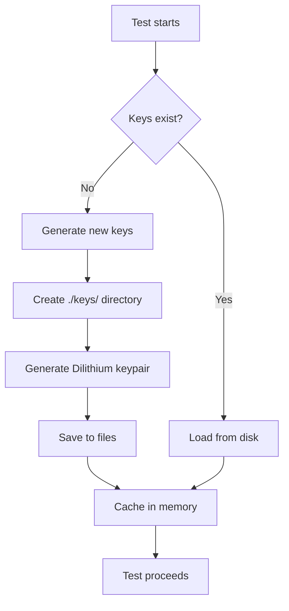

# Automatic Genesis Key Generation (Tests Only)

## 📋 Overview

This document explains the automatic genesis-admin key generation feature for **tests only**.

**Version:** 1.0.6+
**Status:** ✅ Production-ready for test environments

---

## 🎯 Purpose

Simplify test execution by automatically generating genesis-admin keys when they don't exist.

### ✅ **Benefits**
- **No manual setup**: Tests work out-of-the-box
- **Prevents test failures**: No more `NullPointerException` due to missing keys
- **Thread-safe**: Multiple tests can run in parallel safely
- **Idempotent**: Safe to call multiple times

### ❌ **Limitations**
- **ONLY FOR TESTS**: Never use in production or development
- **Non-deterministic**: Each generation creates different keys
- **No persistence guarantee**: Keys can be regenerated if deleted

---

## 🔐 Security Analysis

### Is it Safe to Auto-Generate Keys?

**Short answer:** ✅ **Yes, but ONLY in tests.**

#### Why Safe in Tests?

1. **Temporary databases**: Tests use H2 in-memory or test-specific SQLite
2. **No state persistence**: Tests don't preserve state between runs
3. **Isolated environment**: Test keys don't affect production
4. **Deterministic regeneration**: Each test suite gets fresh keys

#### Why DANGEROUS in Production?

| Risk | Impact | Severity |
|------|--------|----------|
| **Loss of access** | If keys are deleted and regenerated, you lose access to existing blockchain | 🔴 CRITICAL |
| **Non-determinism** | Each generation creates different keys | 🔴 CRITICAL |
| **Security breach** | Keys should be consciously generated, not automatic | 🟠 HIGH |
| **Lack of control** | User may not notice new keys were generated | 🟠 HIGH |

**Conclusion:** 🔐 **Manual generation mandatory for production.**

---

## 🛠️ Usage

### Option 1: Extend `BaseBlockchainTest` (Recommended)

**Simplest approach:**

```java
import com.rbatllet.blockchain.util.BaseBlockchainTest;
import com.rbatllet.blockchain.util.TestGenesisKeyManager;

public class MyBlockchainTest extends BaseBlockchainTest {
    // Genesis keys are automatically available!

    @Test
    void myTest() {
        // Keys are auto-generated if missing, or loaded if exist
        KeyPair genesisKeys = TestGenesisKeyManager.ensureGenesisKeysExist();

        // ... test logic ...
    }
}
```

**What happens:**
1. `@BeforeAll` runs `TestGenesisKeyManager.ensureGenesisKeysExist()`
2. If keys don't exist → generates them automatically
3. If keys exist → loads them from disk
4. Test proceeds with keys available

### Option 2: Use `TestGenesisKeyManager` Directly

**For custom test setups:**

```java
import com.rbatllet.blockchain.util.TestGenesisKeyManager;
import org.junit.jupiter.api.BeforeAll;

public class CustomTest {

    @BeforeAll
    static void setUp() {
        // Ensure genesis keys exist (generates if missing)
        TestGenesisKeyManager.ensureGenesisKeysExist();
    }

    @Test
    void myTest() {
        // Keys are now available
    }
}
```

### Option 3: Check if Keys Exist

**For conditional logic:**

```java
import com.rbatllet.blockchain.util.TestGenesisKeyManager;

if (!TestGenesisKeyManager.keysExist()) {
    System.out.println("⚠️ Keys don't exist - will be auto-generated");
}

KeyPair keys = TestGenesisKeyManager.ensureGenesisKeysExist();
```

---

## 📂 File Locations

| File | Path | Size | Purpose |
|------|------|------|---------|
| Private key | `./keys/genesis-admin.private` | ~6.6KB | Dilithium ML-DSA-87 private key |
| Public key | `./keys/genesis-admin.public` | ~3.5KB | Dilithium ML-DSA-87 public key |

---

## 🔄 Key Generation Process



**Thread-safety:** Entire process is `synchronized` to prevent race conditions.

---

## 🧪 Example Test Output

### First Run (No Keys)

```
[WARN] ⚠️  Genesis-admin keys not found. Generating new keys (TEST CONTEXT ONLY)
[WARN] ⚠️  If you're in production, use: ./tools/generate_genesis_keys.zsh
[INFO] 🔑 Generating new genesis-admin key pair (Dilithium ML-DSA-87)...
[INFO] ✅ Genesis-admin keys generated and saved successfully!
[INFO]    📂 Private key: ./keys/genesis-admin.private
[INFO]    📂 Public key:  ./keys/genesis-admin.public
[INFO] Tests run: 1, Failures: 0, Errors: 0, Skipped: 0
```

### Subsequent Runs (Keys Exist)

```
[INFO] 🔑 Genesis-admin keys found at ./keys/
[DEBUG] ✅ Successfully loaded genesis-admin keys
[INFO] Tests run: 1, Failures: 0, Errors: 0, Skipped: 0
```

---

## 🚨 Production Usage (Manual Generation)

**For production or development environments, use the manual tool:**

```bash
./tools/generate_genesis_keys.zsh
```

**Features:**
- ✅ Detects existing keys (asks for confirmation before overwriting)
- ✅ Creates `./keys/` directory if needed
- ✅ Generates Dilithium ML-DSA-87 keys
- ✅ Shows file details after generation

**Example output:**

```
📊 🔑 Genesis Admin Key Generator
===============================================
ℹ️  🏠 Project directory: /path/to/project
ℹ️  🔍 Checking prerequisites...
✅ All prerequisites satisfied
ℹ️  🔨 Compiling project...
✅ Compilation successful

━━━━━━━━━━━━━━━━━━━━━━━━━━━━━━━━━━━━━━━━━━━━━━━━━━━━━

ℹ️  🔑 Generating genesis admin key pair...

🔑 Generating genesis admin key pair...
✅ Genesis admin keys generated successfully!
   📂 Private key: ./keys/genesis-admin.private
   📂 Public key:  ./keys/genesis-admin.public

━━━━━━━━━━━━━━━━━━━━━━━━━━━━━━━━━━━━━━━━━━━━━━━━━━━━━

✅ ✅ Genesis admin keys generated successfully!
ℹ️  📋 Key files:
   -rw-r--r--  genesis-admin.private  (6.6KB)
   -rw-r--r--  genesis-admin.public   (3.5KB)

✅ 🎉 Keys are ready for use in tests and demos!
```

---

## 🔍 Troubleshooting

### Keys Not Generated

**Symptom:** Test fails with `NullPointerException` on `bootstrapKeyPair.getPublic()`

**Solutions:**

1. **Ensure test extends `BaseBlockchainTest`**:
   ```java
   public class MyTest extends BaseBlockchainTest {
       // ...
   }
   ```

2. **Or call `TestGenesisKeyManager.ensureGenesisKeysExist()` in `@BeforeAll`**:
   ```java
   @BeforeAll
   static void setUp() {
       TestGenesisKeyManager.ensureGenesisKeysExist();
   }
   ```

3. **Check file permissions**: Ensure `./keys/` is writable

### Keys Exist But Test Fails

**Symptom:** Keys exist but test still fails to load them

**Solutions:**

1. **Clear cache**:
   ```java
   TestGenesisKeyManager.clearCache();
   TestGenesisKeyManager.ensureGenesisKeysExist();
   ```

2. **Regenerate keys manually**:
   ```bash
   rm ./keys/genesis-admin.*
   ./tools/generate_genesis_keys.zsh
   ```

3. **Check key format**: Ensure keys are valid Dilithium ML-DSA-87 format

### Multiple Tests Running in Parallel

**Symptom:** Race condition when multiple tests try to generate keys simultaneously

**Solution:** ✅ **Already handled!** `TestGenesisKeyManager.ensureGenesisKeysExist()` is `synchronized`.

---

## 📚 Related Documentation

- [Testing Guide](TESTING.md) - General testing guidelines
- [Security Guide](../security/SECURITY_GUIDE.md) - Security best practices
- [Production Guide](../deployment/PRODUCTION_GUIDE.md) - Production deployment

---

## ⚠️ Important Warnings

### 🔴 NEVER Use in Production

```java
// ❌ WRONG - Do NOT do this in production code!
public class ProductionService {
    public ProductionService() {
        TestGenesisKeyManager.ensureGenesisKeysExist(); // DANGEROUS!
    }
}
```

**Why dangerous:**
- If keys are deleted, new ones are generated
- You lose access to existing blockchain
- Non-deterministic behavior

### ✅ Production Pattern

```bash
# 1. Generate keys ONCE manually
./tools/generate_genesis_keys.zsh

# 2. Backup keys to secure location
cp ./keys/genesis-admin.* /secure/backup/location/

# 3. Add to .gitignore (already done)
echo "keys/*.private" >> .gitignore

# 4. Use existing keys in code
KeyPair keys = KeyFileLoader.loadKeyPairFromFiles(
    "./keys/genesis-admin.private",
    "./keys/genesis-admin.public"
);

if (keys == null) {
    throw new RuntimeException("Genesis keys not found! Generate with ./tools/generate_genesis_keys.zsh");
}
```

---

## 📊 Summary

| Context | Auto-Generation | Manual Generation | Recommendation |
|---------|----------------|-------------------|----------------|
| **Unit Tests** | ✅ Recommended | 🟡 Optional | Use `BaseBlockchainTest` |
| **Integration Tests** | ✅ Recommended | 🟡 Optional | Use `BaseBlockchainTest` |
| **Development** | ❌ Dangerous | ✅ Required | Use `./tools/generate_genesis_keys.zsh` |
| **Production** | 🔴 **CRITICAL: Never!** | ✅ **Mandatory** | Manual + secure backup |

---

**Last Updated:** 2025-11-29
**Version:** 1.0.6
